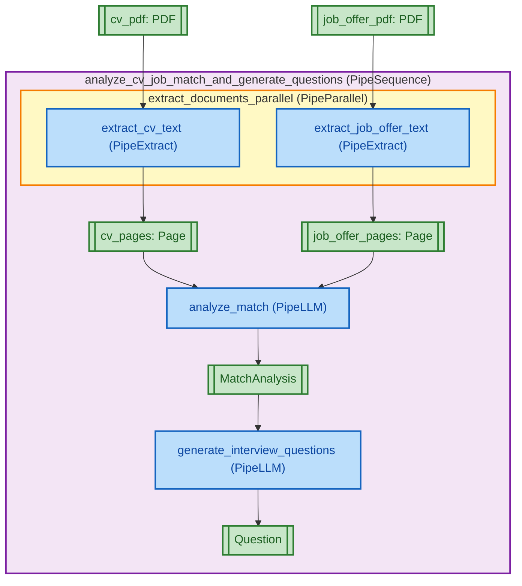

<div align="center">
  <a href="https://www.pipelex.com/"></a>
  <br/>
  <br/>

  <!-- PRERELEASE_LINK -->
  <a href="https://github.com/Pipelex/pipelex-cookbook/tree/feature/Chicago">
    
  </a>

  <br/>
  <br/>
  <h2 align="center">Pipelex Cookbook 📚</h2>
  <!-- PRERELEASE_LINK -->
  <p align="center">Examples, recipes, and best-practice pipelines for the <strong><a href="https://github.com/Pipelex/pipelex/tree/pre-release/v0.18.0b1">Pipelex</a></strong> AI workflow framework.<br/>
Learn by doing with production-ready examples.</p>

  <div>
    <a href="https://go.pipelex.com/demo"><strong>Demo</strong></a> -
    <a href="https://docs.pipelex.com/"><strong>Documentation</strong></a> -
    <a href="https://docs.pipelex.com/pages/cookbook-examples/"><strong>Cookbook Examples</strong></a> -
    <a href="https://github.com/Pipelex/pipelex-cookbook/issues"><strong>Report Bug</strong></a> -
    <a href="https://github.com/Pipelex/pipelex-cookbook/discussions"><strong>Feature Request</strong></a>
  </div>
  <br/>

  <p align="center">
    <a href="LICENSE"></a>
    <br/>
    <a href="https://go.pipelex.com/discord"></a>
    <a href="https://www.youtube.com/@PipelexAI"></a>
    <a href="https://pipelex.com"></a>
<!-- PRERELEASE_LINK -->
    <a href="https://github.com/Pipelex/pipelex/tree/pre-release/v0.18.0b1"></a>
    <a href="https://docs.pipelex.com/"></a>
    <br/> 
    <br/>
</div>

# 🚀 Quick Start

## 1. Clone and Install

<!-- PRERELEASE_LINK -->
```bash
# Clone Pipelex Cookbook from Pre-release branch "Chicago"
git clone -b feature/Chicago https://github.com/Pipelex/pipelex-cookbook.git
cd pipelex-cookbook

# Create and activate virtual environment
python -m venv .venv
# or python3 -m venv .venv
source .venv/bin/activate

# Install
pip install .  # or uv sync
```

## 2. Get Your API Key (Free)

Sign up at [app.pipelex.com](https://app.pipelex.com) to get **free API credits** with access to **all models** (text, vision, OCR, image generation).

Add your key to `.env`:
```bash
PIPELEX_GATEWAY_API_KEY=your_api_key_here
```

Want to bring your own API keys or use local models? See [Configure AI Providers](https://docs.pipelex.com/pages/setup/configure-ai-providers/).

## 3. Learn Pipelex

**New to Pipelex?** Follow the tutorials to learn step-by-step:

| Level | Tutorial | What you'll learn |
|-------|----------|-------------------|
| Easy | [LLM Basics](./tutorial/easy/llm_basics/) | Make LLM calls, chain them together, format output |
| Easy | [Structured Data](./tutorial/easy/structured_data/) | Extract structured objects from text and documents |
| Medium | [Model Configuration](./tutorial/medium/) | Control which LLM to use and configure temperature |
| Medium | [Batch Processing](./tutorial/medium/) | Process lists of items efficiently |
| Medium | [Parallel Execution](./tutorial/medium/) | Run independent tasks at the same time |

**Already familiar?** Jump straight to the examples below.

## 4. Run Examples

Try the hello world example:

```bash
python examples/a_quick_start/hello_world.py
```

Or explore other cookbook examples:

```bash
# Extract data from a Gantt chart image
python examples/b_basics/document_extract/extract_gantt/extract_gantt.py

# Extract and summarize invoice information
python examples/b_basics/document_extract/extract_invoice/extract_invoice.py

# Multi-step text summarization
python examples/a_quick_start/summarize_2_steps.py
```

## 5. Known Limitations

### Third-Party API Requirements

Some Pipelex pipes currently require additional API keys beyond the Pipelex Inference backend:

- **OCR (PipeExtract)**: Currently uses Mistral for document extraction. You'll need a [Mistral API key](https://console.mistral.ai/) to use `PipeExtract` operations for extracting text and images from PDFs and images.
- **Image Generation (PipeImgGen)**: Currently uses FAL for image generation. You'll need a [FAL API key](https://fal.ai/dashboard/keys) to use `PipeImgGen` operations for generating images.

**Note:** These dependencies are temporary and will be addressed in future updates. We're working on adding support for multiple providers and local alternatives. Check our [roadmap](https://github.com/Pipelex/pipelex/issues/473) for planned improvements.

## 6. Generate Your Own Workflow

Create a complete AI workflow with a single command:

```bash
pipelex build pipe "Take a CV and Job offer in PDF, analyze if they match and generate 5 questions for the interview" --output results/cv_match.plx
```

This command generates a production-ready `.plx` file with domain definitions, concepts, and multiple processing steps that analyzes CV-job fit and prepares interview questions.

**cv_match.plx**
```toml
domain = "cv_match"
description = "Matching CVs with job offers and generating interview questions"
main_pipe = "analyze_cv_job_match_and_generate_questions"

[concept.MatchAnalysis]
description = """
Analysis of alignment between a candidate and a position, including strengths, gaps, and areas requiring further exploration.
"""

[concept.MatchAnalysis.structure]
strengths = { type = "text", description = "Areas where the candidate's profile aligns well with the requirements", required = true }
gaps = { type = "text", description = "Areas where the candidate's profile does not meet the requirements or lacks evidence", required = true }
areas_to_probe = { type = "text", description = "Topics or competencies that need clarification or deeper assessment during the interview", required = true }

[concept.Question]
description = "A single interview question designed to assess a candidate."
refines = "Text"

[pipe.analyze_cv_job_match_and_generate_questions]
type = "PipeSequence"
description = """
Main pipeline that orchestrates the complete CV-job matching and interview question generation workflow. Takes a candidate's CV and a job offer as PDF documents, extracts their content, performs a comprehensive match analysis identifying strengths, gaps, and areas to probe, and generates exactly 5 targeted interview questions based on the analysis results.
"""
inputs = { cv_pdf = "PDF", job_offer_pdf = "PDF" }
output = "Question[5]"
steps = [
    { pipe = "extract_documents_parallel", result = "extracted_documents" },
    { pipe = "analyze_match", result = "match_analysis" },
    { pipe = "generate_interview_questions", result = "interview_questions" },
]
```

<details>
<summary><b>📄 Click to view the supporting pipes implementation</b></summary>

```toml
[pipe.extract_documents_parallel]
type = "PipeParallel"
description = """
Executes parallel extraction of text content from both the CV PDF and job offer PDF simultaneously to optimize processing time.
"""
inputs = { cv_pdf = "PDF", job_offer_pdf = "PDF" }
output = "Dynamic"
parallels = [
    { pipe = "extract_cv_text", result = "cv_pages" },
    { pipe = "extract_job_offer_text", result = "job_offer_pages" },
]
add_each_output = true

[pipe.extract_cv_text]
type = "PipeExtract"
description = """
Extracts text content from the candidate's CV PDF document using OCR technology, converting all pages into machine-readable text format for subsequent analysis.
"""
inputs = { cv_pdf = "PDF" }
output = "Page[]"
model = "extract_text_from_pdf"

[pipe.extract_job_offer_text]
type = "PipeExtract"
description = """
Extracts text content from the job offer PDF document using OCR technology, converting all pages into machine-readable text format for subsequent analysis.
"""
inputs = { job_offer_pdf = "PDF" }
output = "Page[]"
model = "extract_text_from_pdf"

[pipe.analyze_match]
type = "PipeLLM"
description = """
Performs comprehensive analysis comparing the candidate's CV against the job offer requirements. Identifies and structures: (1) strengths where the candidate's profile aligns well with requirements, (2) gaps where the profile lacks evidence or doesn't meet requirements, and (3) specific areas requiring deeper exploration or clarification during the interview process.
"""
inputs = { cv_pages = "Page[]", job_offer_pages = "Page[]" }
output = "MatchAnalysis"
model = "llm_to_answer_hard_questions"
system_prompt = """
You are an expert HR analyst and recruiter specializing in candidate-job fit assessment. Your task is to generate a structured MatchAnalysis comparing a candidate's CV against job requirements.
"""
prompt = """
Analyze the match between the candidate's CV and the job offer requirements.

Candidate CV:
@cv_pages

Job Offer:
@job_offer_pages

Perform a comprehensive comparison and provide a structured analysis.
"""

[pipe.generate_interview_questions]
type = "PipeLLM"
description = """
Generates exactly 5 targeted, relevant interview questions based on the match analysis results. Questions are designed to probe identified gaps, clarify areas of uncertainty, validate strengths, and assess competencies that require deeper evaluation to determine candidate-position fit.
"""
inputs = { match_analysis = "MatchAnalysis" }
output = "Question[5]"
model = "llm_to_write_questions"
system_prompt = """
You are an expert HR interviewer and talent assessment specialist. Your task is to generate structured interview questions based on candidate-position match analysis.
"""
prompt = """
Based on the following match analysis between a candidate and a position, generate exactly 5 targeted interview questions.

@match_analysis

The questions should:
- Probe the identified gaps to assess if they are deal-breakers or can be mitigated
- Clarify areas that require deeper exploration
- Validate the candidate's strengths with concrete examples
- Be open-ended and behavioral when appropriate
- Help determine overall candidate-position fit

Generate exactly 5 interview questions.
"""
```
</details>


**View the pipeline flowchart:**



**Run the pipeline:**

```bash
# Via CLI with input file
pipelex run results/cv_match.plx --inputs inputs.json
```

Create an `inputs.json` file with your PDF URLs:

```json
{
  "cv_pdf": {
    "concept": "PDF",
    "content": {
      "url": "https://pipelex-web.s3.amazonaws.com/demo/John-Doe-CV.pdf"
    }
  },
  "job_offer_pdf": {
    "concept": "PDF",
    "content": {
      "url": "https://pipelex-web.s3.amazonaws.com/demo/Job-Offer.pdf"
    }
  }
}
```

**Or via Python:**

```python
import asyncio
import json
from pipelex.pipeline.execute import execute_pipeline
from pipelex.pipelex import Pipelex

async def run_pipeline():
    with open("inputs.json", encoding="utf-8") as f:
        inputs = json.load(f)

    pipe_output = await execute_pipeline(
        pipe_code="cv_match",
        inputs=inputs
    )
    print(pipe_output.main_stuff_as_str)

Pipelex.make()
asyncio.run(run_pipeline())
```

## 7. Iterate with AI Assistance

Install AI assistant rules to easily modify your pipelines:

```bash
pipelex kit rules
```

This installs rules for Cursor, Claude, OpenAI Codex, GitHub Copilot, Windsurf, and Blackbox AI. Now you can refine pipelines with natural language:

- "Include confidence scores between 0 and 100 in the match analysis"
- "Write a recap email at the end"

## 💡 What is Pipelex?

Pipelex is an open-source language that enables you to build and run **repeatable AI workflows**. Instead of cramming everything into one complex prompt, you break tasks into focused steps, each pipe handling one clear transformation.

Each pipe processes information using **Concepts** (typing with meaning) to ensure your pipelines make sense. The Pipelex language (`.plx` files) is simple and human-readable, even for non-technical users. Each step can be structured and validated, giving you the reliability of software with the intelligence of AI.

## 🔧 IDE Extension

We **highly** recommend installing our extension for `.plx` files into your IDE. You can find it in the [Open VSX Registry](https://open-vsx.org/extension/Pipelex/pipelex). It's coming soon to VS Code marketplace too. If you're using Cursor, Windsurf or another VS Code fork, you can search for it directly in your extensions tab.

## 📚 Repository Layout

```
.
├── examples/                  # Production-ready examples
│   ├── a_quick_start/         # Getting started tutorials
│   ├── b_basics/              # Core functionality examples
│   │   └── document_extract/  # Document extraction examples
│   │       ├── extract_dpe/
│   │       ├── extract_gantt/
│   │       ├── extract_generic/
│   │       ├── extract_invoice/
│   │       ├── extract_proof_of_purchase/
│   │       └── extract_table/
│   ├── c_advanced/            # Advanced features
│   │   ├── gen_synthetic_data/
│   │   └── using_inference_plugins/
│   └── wip/                   # Work in progress examples
├── assets/                    # Sample data files for examples
├── tests/                     # Test suite for all examples
└── utils/                     # Helper utilities
```

## 🎯 Explore Cookbook Examples

The cookbook contains production-ready examples covering various use cases:

### Getting Started
- **Hello World** - Your first Pipelex pipeline
- **Simple OCR** - Extract text from documents
- **Summarization** - Multi-step text summarization with structured output

### Document Processing
- **Invoice Extractor** - Extract structured data from invoices
- **Expense Report** - Process and validate expense reports
- **DPE Extraction** - Extract energy performance diagnostics
- **Generic Document** - Extract content from any document type

### Visual Data Extraction
- **Gantt Chart** - Extract project timelines from visual diagrams
- **Table Extraction** - Extract structured tables from images

### Advanced Workflows
- **Data Synthesis** - Generate synthetic data based on schemas
- **Advisory Board** (WIP) - Multi-agent advisory system
- **Newsletter Generation** (WIP) - Automated newsletter creation

Each example includes:
- Complete `.plx` pipeline definition
- Python execution script
- Sample input data in `assets/`
- Structured output models where applicable

## 📖 Next Steps

**Learn More:**
- [Writing Workflows Tutorial](https://docs.pipelex.com/pages/writing-workflows/) - Complete guide with examples
- [Build Reliable AI Workflows](https://docs.pipelex.com/pages/build-reliable-ai-workflows-with-pipelex/kick-off-a-pipelex-workflow-project/) - Deep dive into Pipelex
- [Configuration Guide](https://docs.pipelex.com/pages/setup/configure-ai-providers/) - Set up AI providers and models
- [Cookbook Examples](https://docs.pipelex.com/pages/cookbook-examples/) - Detailed documentation of cookbook examples

## 🤝 Contributing

We ❤️ contributions! Before opening a pull request, please:

<!-- PRERELEASE_LINK -->
1. **Read [`CONTRIBUTING.md`](CONTRIBUTING.md)** and the [main repository's contributing guide](https://github.com/Pipelex/pipelex/blob/pre-release/v0.18.0b1/CONTRIBUTING.md).
2. Add your file under **`examples/wip/<your-folder>`**; feel free to group related examples by topic.
3. Include a short **README or docstring** at the top describing purpose, inputs, and expected outputs.
4. Verify the pipeline runs locally with a free/open LLM preset when possible, to lower the entry barrier for reviewers.

> **Tip:** If you're unsure whether your idea fits, open a GitHub **Discussion** first—feedback is fast and public.

## 👥 Join the Community

Join our vibrant Discord community to connect with other developers, share your experiences, and get help with your Pipelex projects!

[](https://go.pipelex.com/discord)

## 💬 Support

| Channel | Use case |
| ------- | -------- |
| **GitHub Discussions → "Show & Tell"** | Share ideas, brainstorm, get early feedback. |
| **GitHub Issues** | Report bugs or request features. |
| **Discord** | Real-time chat — [https://go.pipelex.com/discord](https://go.pipelex.com/discord) |
| **Email (privacy & security)** | [security@pipelex.com](mailto:security@pipelex.com) |
| [**Documentation**](https://docs.pipelex.com/) | Comprehensive guides and API reference |

## ⭐ Star Us!

If you find Pipelex helpful, please consider giving us a star on both repositories! It helps us reach more developers and continue improving the tool.

- ⭐ [Main Pipelex Repository](https://github.com/Pipelex/pipelex)
- ⭐ [Pipelex Cookbook Repository](https://github.com/Pipelex/pipelex-cookbook)

## 📝 License

This project is licensed under the [MIT license](LICENSE). Runtime dependencies are distributed under their own licenses via PyPI.

---

*Happy piping!* 🚀

"Pipelex" is a trademark of Evotis S.A.S.

© 2025 Evotis S.A.S.
