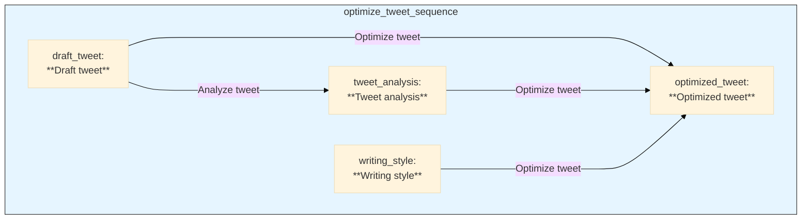

# Pipelex Cookbook 📚

> Examples, recipes, and best-practice pipelines for the **[Pipelex](https://github.com/Pipelex/pipelex)** LLM Pipeline framework.


If you just want to **run** an example, jump to **Quick Start**. If you'd like to **share** your own pipeline, head straight to **Contributing**. :books: Check out the [Pipelex Documentation](https://docs.pipelex.com/) for more information, in particular the [Cookbook examples](https://docs.pipelex.com/pages/cookbook-examples/) section.

---

## Table of Contents

1. [Repository Layout](#repository-layout)  
2. [Quick Start](#quick-start)  
3. [Contributing](#contributing)  
4. [Contact & Support](#contact--support)  

---

## Repository Layout

```
.
├── pipelex_libraries/         # Main library code
│   ├── pipelines/             # Pipeline implementations
│   │   ├── base_library/      # Core pipeline components
│   │   ├── examples/          # Example pipelines
│   │   └── quick_start/       # Quick start tutorials
│   ├── llm_deck/              # LLM deck components
│   ├── llm_integrations/      # LLM provider integrations
│   └── templates/             # Prompt templates
├── examples/                  # Advanced examples (PDF extraction, expense processing, etc.)
|   ├── wip/                   # Work in progress examples
└── quick_start/               # Getting started tutorials
```

---

## Quick Start

```bash
git clone https://github.com/Pipelex/pipelex-cookbook.git
cd pipelex-cookbook
```

### Create virtual environment, install Pipelex and other dependencies

```bash
make install
```

This will install the Pipelex python library and its dependencies using uv.

### Set up environment variables

```bash
cp .env.example .env
```

Enter your API keys into your `.env` file. The `OPENAI_API_KEY` is enough to get you started, but some pipelines require models from other providers.

### Run Hello World

```bash
python quick_start/hello_world.py
```
---

## Example: optimizing a tweet in 2 steps

### 1. Define the pipeline in TOML

```toml
domain = "tech_tweet"
definition = "A pipeline for optimizing tech tweets using Twitter/X best practices"

[concept]
DraftTweet = "A draft version of a tech tweet that needs optimization"
OptimizedTweet = "A tweet optimized for Twitter/X engagement following best practices"
TweetAnalysis = "Analysis of the tweet's structure and potential improvements"
WritingStyle = "A style of writing"

[pipe]
[pipe.analyze_tweet]
type = "PipeLLM"
definition = "Analyze the draft tweet and identify areas for improvement"
inputs = { draft_tweet = "DraftTweet" }
output = "TweetAnalysis"
llm = "llm_for_writing_analysis"
system_prompt = """
You are an expert in social media optimization, particularly for tech content on Twitter/X.
Your role is to analyze tech tweets and check if they display typical startup communication pitfalls.
"""
prompt_template = """
Evaluate the tweet for these key issues:

**Fluffiness** - Overuse of buzzwords without concrete meaning (e.g., "synergizing disruptive paradigms")

**Cringiness** - Content that induces secondhand embarrassment (overly enthusiastic, trying too hard to be cool, excessive emoji use)

**Humblebragginess** - Disguising boasts as casual updates or false modesty ("just happened to close our $ 10M round 🤷")

**Vagueness** - Failing to clearly communicate what the product/service actually does

For each criterion, provide:
1. A score (1-5) where 1 = not present, 5 = severely present
2. If the problem is not present, no comment. Otherwise, explain of the issue and give concise guidance on fixing it, without providing an actual rewrite

@draft_tweet

"""

[pipe.optimize_tweet]
type = "PipeLLM"
definition = "Optimize the tweet based on the analysis"
inputs = { draft_tweet = "DraftTweet", tweet_analysis = "TweetAnalysis", writing_style = "WritingStyle" }
output = "OptimizedTweet"
llm = "llm_for_social_post_writing"
system_prompt = """
You are an expert in writing engaging tech tweets that drive meaningful discussions and engagement.
Your goal is to rewrite tweets to be impactful and avoid the pitfalls identified in the analysis.
"""
prompt_template = """
Rewrite this tech tweet to be more engaging and effective, based on the analysis:

Original tweet:
@draft_tweet

Analysis:
@tweet_analysis

Requirements:
- Include a clear call-to-action
- Make it engaging and shareable
- Use clear, concise language

### Reference style example

@writing_style

### Additional style instructions

No hashtags.
Minimal emojis.
Keep the core meaning of the original tweet.
"""

[pipe.optimize_tweet_sequence]
type = "PipeSequence"
definition = "Analyze and optimize a tech tweet in sequence"
inputs = { draft_tweet = "DraftTweet", writing_style = "WritingStyle" }
output = "OptimizedTweet"
steps = [
    { pipe = "analyze_tweet", result = "tweet_analysis" },
    { pipe = "optimize_tweet", result = "optimized_tweet" },
]
```

### 2. Run the pipeline

Here is the flowchart generated during this run:



### 3. wait… no, there is not 3, you're done!

---

## Contributing

We ❤️ contributions!  Before opening a pull request, please:

1. **Read [`CONTRIBUTING.md`](CONTRIBUTING.md)**.
2. Add your file under **`examples/wip/<your-folder>`**; feel free to group related examples by topic.
3. Include a short **README snippet at the top of your TOML** describing purpose, inputs, and expected outputs.
4. Verify the pipeline runs locally with a free/open LLM preset when possible, to lower the entry barrier for reviewers.

> **Tip:** If you're unsure whether your idea fits, open a GitHub **Discussion** first—feedback is fast and public.([GitHub Docs][4])

---

## Contact & Support

| Channel                                | Use case                                                                  |
| -------------------------------------- | ------------------------------------------------------------------------- |
| **GitHub Discussions → "Show & Tell"** | Share ideas, brainstorm, get early feedback.                              |
| **GitHub Issues**                      | Report bugs or request features.                                          |
| **Email (privacy & security)**         | [security@pipelex.com](mailto:security@pipelex.com)                       |
| **Discord**                            | Real-time chat — [https://go.pipelex.com/discord](https://go.pipelex.com/discord) |


## 📝 License

This project is licensed under the [MIT license](LICENSE). Runtime dependencies are distributed under their own licenses via PyPI.

---

*Happy piping!* 🚀
