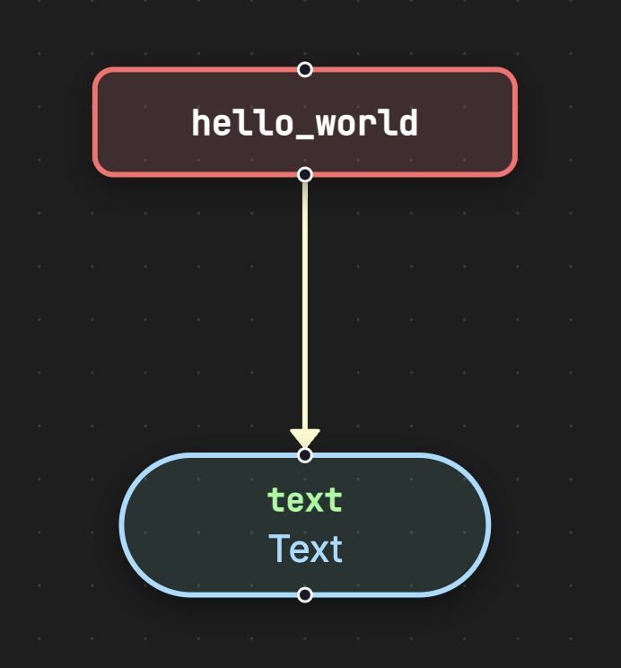
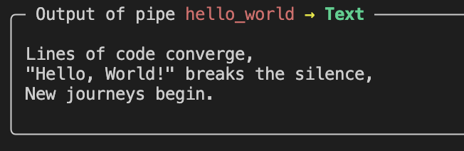
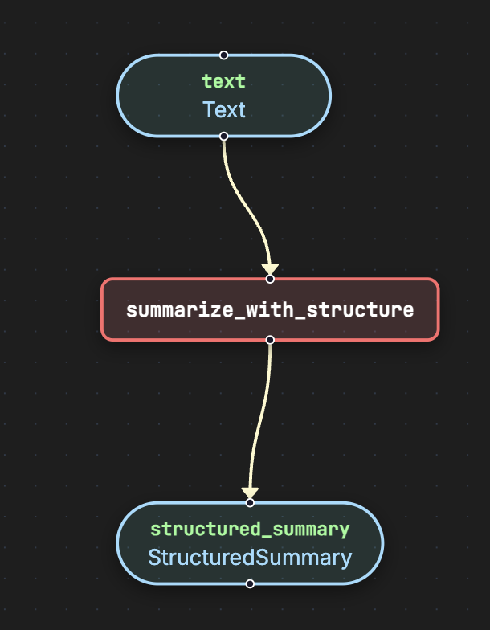
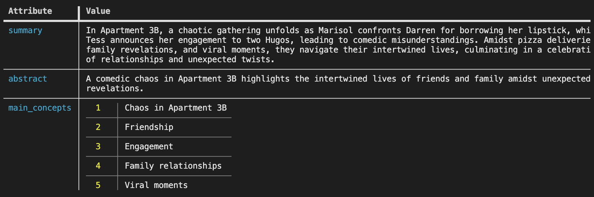

# Quick Start Examples

This folder contains simple pipelines that demonstrate the basics of running Pipelex.

## Prerequisites

Before running these examples, ensure you have set up your environment. See the [Clone and Install](../../README.md#1-clone-and-install) section in the main README.

## Hello World

A minimal pipeline that generates text.

### Run the pipeline

```bash
pipelex run pipe examples/a_quick_start/hello_world.mthds
```

### Flowchart



### Expected output



---

## Summarize

Text summarization pipelines with structured output.

### Run the pipeline

```bash
# Summarization with structured output
pipelex run pipe examples/a_quick_start/summarize.mthds --pipe summarize_with_structure -i examples/a_quick_start/inputs.json

# Multi-step summarization
pipelex run pipe examples/a_quick_start/summarize.mthds --pipe summarize_by_steps -i examples/a_quick_start/inputs.json
```

### Flowchart



### Expected output




### Go further

You can go further by generating the python structures and runner code out of this bundle in order to add validation functions to the python BaseModel.

```bash
pipelex build runner examples/a_quick_start/summarize.mthds --pipe summarize_with_structure
```

This will create a new file `examples/a_quick_start/run_summarize_with_structure.py` and a `structures` directory containing the python structures.
