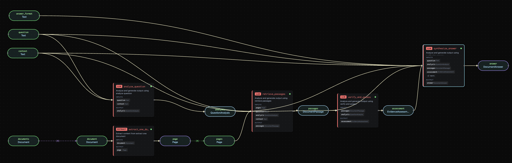
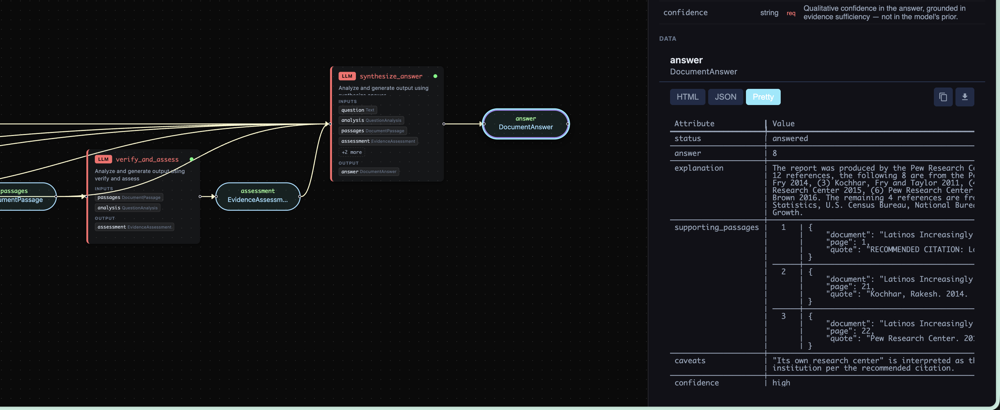

# answer_from_documents

Want to extract the answer of a question from a set of documents? Here is how.

One of the benefits of Pipelex is the ability to use a different model for each task. In this example:

- Reading and retrieving passages from the text: Gemini
- Thinking and answering the question: Claude



Given any set of documents and any question, returns a structured answer with verbatim citations, principled abstention, and an explicit status that distinguishes full answers, partial answers, and every flavor of "I don't know."

## Why this exists

Most document-QA systems fail in one of three ways: they answer confidently from world knowledge when the documents do not contain the answer, they hallucinate citations (page numbers that don't exist, quotes that paraphrase rather than quote), or they give a single-shape answer regardless of whether evidence was sufficient, partial, or absent.

`answer_from_documents` is designed to fail _visibly_ and _truthfully_. Every answer is grounded in verbatim passages. When the documents can't support a confident answer, the method tells you why, with a specific status.

## What it does

Takes a list of documents, a question, and optional context. Returns a `DocumentAnswer` with a strict short-form answer, the supporting passages quoted verbatim, and a status that distinguishes confident answers from each kind of abstention.

Internally runs a five-step pipeline — one user-facing call:

1. **Extract** pages from each document in the input list.
2. **Analyze the question** — classify its type, decide whether it's answerable from documents at all, decompose compound questions into sub-questions, and generate reformulations that help retrieval find evidence when documents use different vocabulary.
3. **Retrieve passages** — a long-context pass that reads the full document set and pulls verbatim quotes for each sub-question. Returns an empty list if nothing is relevant (never pads).
4. **Verify and assess** — check coverage against every sub-question, surface contradictions across sources, and judge sufficiency (sufficient / partial / insufficient / none).
5. **Synthesize** — produce the final answer with a calibrated status, every factual claim traceable to a cited passage.

## Inputs

| Input       | Type         | Required           | Purpose                                                                      |
| ----------- | ------------ | ------------------ | ---------------------------------------------------------------------------- |
| `documents` | `Document[]` | yes                | Any count, any format `native.Document` accepts (PDF, Word, image, web page) |
| `question`  | `Text`       | yes                | Any question                                                                 |
| `context`   | `Text`       | yes (may be empty) | Background information to disambiguate the question and guide synthesis     |

### About the `context` input

Context is for information that is **not a document to answer from** but that helps the method interpret the question correctly — domain-specific term definitions ("in this company, 'revenue' means GAAP net"), audience calibration ("for a CFO briefing"), temporal defaults ("'last quarter' = Q3 2024"), or scope constraints ("only the European subsidiary").

Critical contract:

- Context is **never cited**. `supporting_passages` only contains quotes from documents.
- Context is **never treated as evidence**. If the answer exists only in context and not in documents, the method returns `not_in_documents` — not `answered`.

Pass empty text to omit.

## Output

The output structure is supplied by the caller — pass any concept declared in the bundle as `dynamic_output_concept_ref` when executing the pipeline.

For this example, we declare `ReferenceCount` (tailored to the question "how many references are from its own research center?"):

- `count` — the integer answer
- `explanation` — short prose justification grounded in the cited passages

> **This is a real structured output, not a JSON-shaped string.** `count` is a Python `int` you can do arithmetic on (`result.count + 1`, `sum(...)`), validated by Pydantic at parse time — not a number embedded in free text that you'd have to regex out. The whole point of declaring `ReferenceCount` as a concept is that the LLM is forced into that schema and the runner returns a typed object.



The bundle also declares `DocumentAnswer` for callers who want the rich envelope with status enum, supporting passages, contradictions, caveats, and confidence.

## Usage

Three ways to run it — pick whichever fits your workflow. All three resolve the same dynamic output concept (`document_qa.ReferenceCount`) and produce the same typed `ReferenceCount` object.

### Via the `mthds` CLI

```bash
mthds run bundle examples/b_basics/document_extract/answer_from_documents/ \
  -O document_qa.ReferenceCount
```

### Via the `pipelex` CLI

```bash
pipelex run bundle examples/b_basics/document_extract/answer_from_documents/ \
  -O document_qa.ReferenceCount
```

`-O` (long form: `--dynamic-output-concept`) tells the runner which structured concept to populate. The bundle declares its main pipe's output as `Dynamic`, so the concept is selected at run time. `inputs.json` is auto-detected from the bundle directory; pass `-i path/to/inputs.json` to override.

### Via the Python runner

```bash
python examples/b_basics/document_extract/answer_from_documents/run_answer_from_documents.py
```

The runner specifies the output concept dynamically:

```python
response = await runner.execute_pipeline(
    pipe_code="answer_from_documents",
    dynamic_output_concept_ref="document_qa.ReferenceCount",
    inputs={...},
)
result = response.pipe_output.main_stuff_as(content_type=ReferenceCount)
# result.count is a real int — assert isinstance(result.count, int)
```

To get a different output shape, swap the concept string (e.g. `"document_qa.DocumentAnswer"`) — the bundle is unchanged.

The structures and runner were generated with:

```bash
pipelex build structures examples/b_basics/document_extract/answer_from_documents/bundle.mthds
pipelex build runner bundle examples/b_basics/document_extract/answer_from_documents/bundle.mthds
```

## Models

The method uses three model aliases. Configure them in your runtime to control cost and quality:

| Step                            | Alias                       | Recommendation                                                                                  |
| ------------------------------- | --------------------------- | ----------------------------------------------------------------------------------------------- |
| Document extraction             | `@default-extract-document` | Any reliable OCR / text extractor                                                               |
| Question analysis, verification | `$writing-factual`          | A fast, reliable instruction-following model                                                    |
| Retrieval                       | `@best-gemini`              | A long-context model (gemini-3.0-pro or similar). Must fit the full document set plus analysis. |
| Synthesis                       | `$writing-factual`          | A reasoning-capable model                                                                       |

## Known limits in v0.1.0

- The combined document set must fit in the retrieval model's context window. For very large corpora, a future `answer_from_corpus` variant will add a map-reduce layer.
- The method is stateless. There is no multi-turn memory or follow-up handling.
- `ambiguities[]` are returned in the internal question analysis but the method does not ask clarifying questions — callers decide whether to prompt the user before running.

## Design rationale

See the top-level `DESIGN.md` for the full design note, including why the pipeline has five steps (not three or seven), why retrieval and synthesis are separated, and which alternatives were considered and rejected.

## Stability

This method's inputs, outputs, and concept shapes are part of the `mthds-std` v0.1 stability contract. Breaking changes require a major version bump plus a deprecation window. See `STABILITY.md`.
