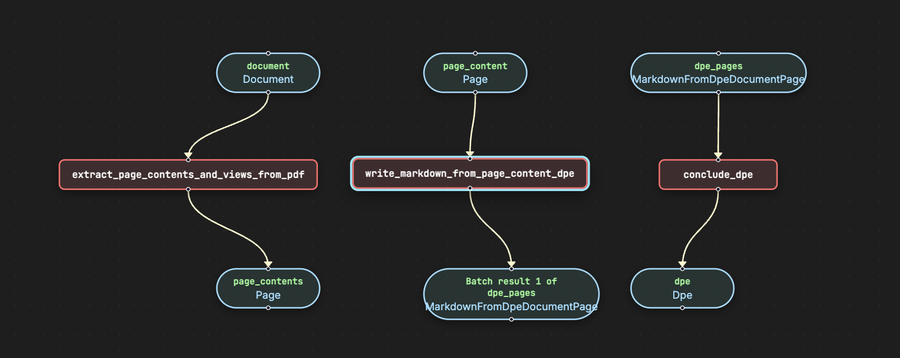
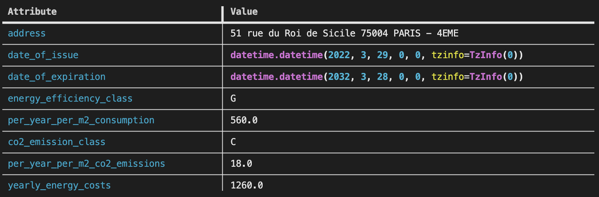

# Extract DPE (Diagnostic de Performance Énergétique)

Extract energy performance diagnostic information from French DPE documents which is a PDF file. 

## Run the pipeline

```bash
pipelex run examples/b_basics/document_extract/extract_dpe/bundle.plx -i examples/b_basics/document_extract/extract_dpe/inputs.json -L examples/documents
```

## Flowchart



## Expected output




## Go further

You can go further by generating the python structures and runner code out of this bundle in order to add validation functions to the python BaseModel. 

```bash
pipelex build runner examples/b_basics/document_extract/extract_dpe/bundle.plx -L examples/documents
```

This will create a new file `examples/b_basics/document_extract/extract_dpe/run_power_extractor_dpe.py` and a `structures` directory containing the python structures.