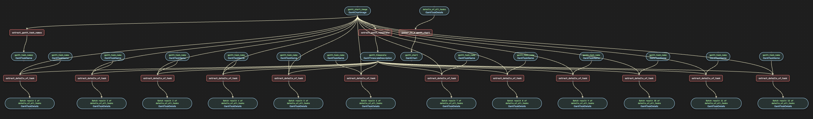

# Extract Gantt Chart

Extract structured data from Gantt chart images.

## Prerequisites

Before running this example, ensure you have set up your environment. See the [Clone and Install](../../../../README.md#1-clone-and-install) section in the main README.

## Run the pipeline

```bash
pipelex run bundle examples/b_basics/document_extract/extract_gantt/
```

## Flowchart



## Expected output


## Go further

You can go further by generating the python structures and runner code out of this bundle in order to add validation functions to the python BaseModel.

```bash
pipelex build runner bundle examples/b_basics/document_extract/extract_gantt/bundle.mthds
```

This will create a new file `examples/b_basics/document_extract/extract_gantt/run_extract_gantt_by_steps.py` and a `structures` directory containing the python structures.
