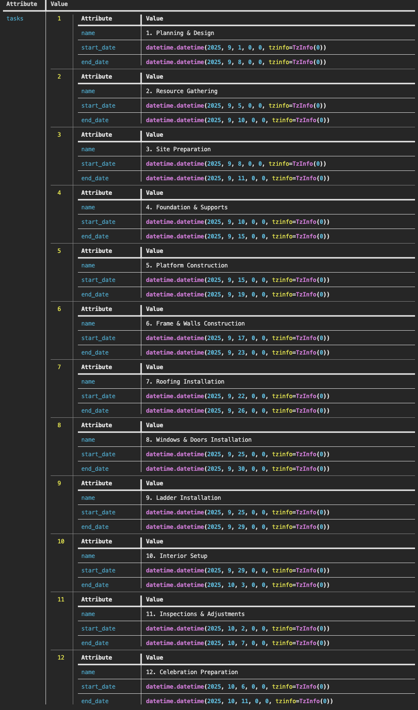

# Extract Gantt Chart

Extract structured data from Gantt chart images.

## Run the pipeline

```bash
pipelex run examples/b_basics/document_extract/extract_gantt/gantt.plx --inputs examples/b_basics/document_extract/extract_gantt/inputs.json
```

## Expected output



## Flowchart

<!-- Pipeline flowchart will be added here -->
