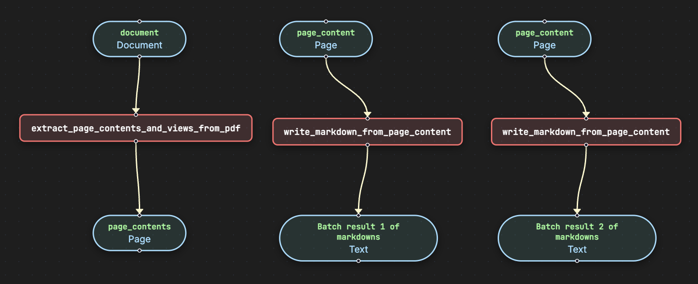
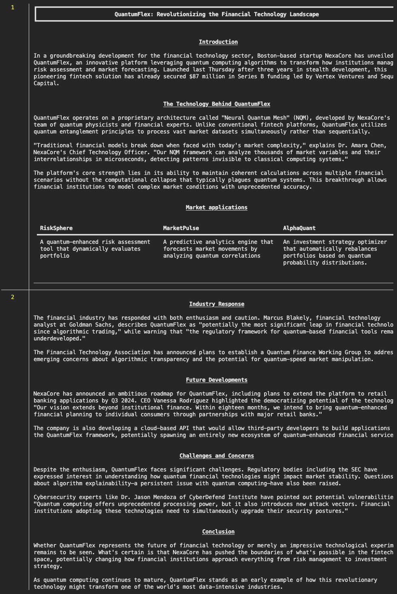

# Extract Generic

Generic document extraction pipeline for various document types.

## Run the pipeline

```bash
pipelex run examples/b_basics/document_extract/extract_generic/bundle.plx -i examples/b_basics/document_extract/extract_generic/inputs.json -L examples
```

## Flowchart



## Expected output




## Go further

You can go further by generating the python structures and runner code out of this bundle in order to add validation functions to the python BaseModel.

```bash
pipelex build runner examples/b_basics/document_extract/extract_generic/bundle.plx -L examples/documents
```

This will create a new file `examples/b_basics/document_extract/extract_generic/run_power_extractor.py` and a `structures` directory containing the python structures.
