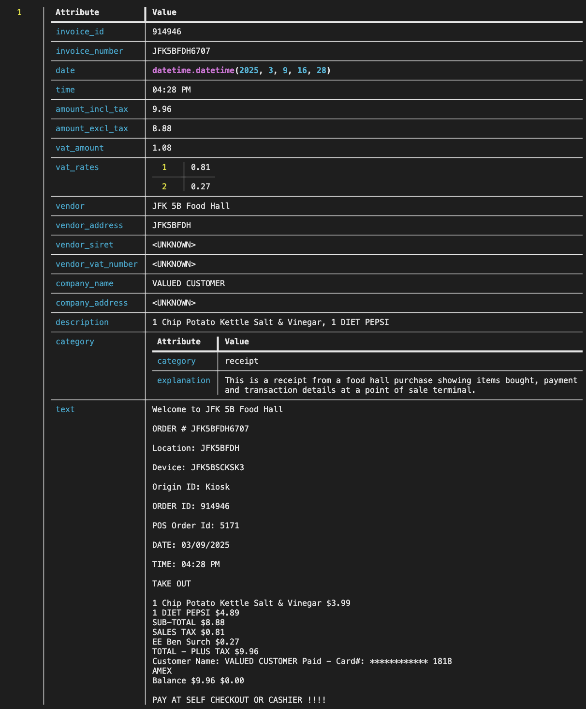

# Extract Invoice

Extract structured invoice information from PDF documents.

## Run the pipeline

```bash
pipelex run examples/b_basics/document_extract/extract_invoice/invoice.plx --inputs examples/b_basics/document_extract/extract_invoice/inputs.json
```

## Expected output



## Flowchart

<!-- Pipeline flowchart will be added here -->
