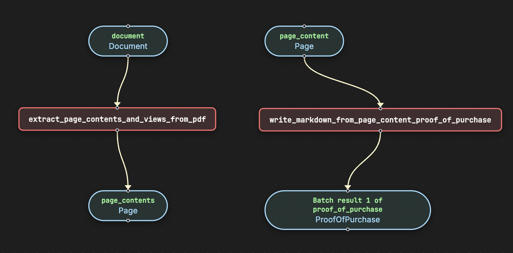
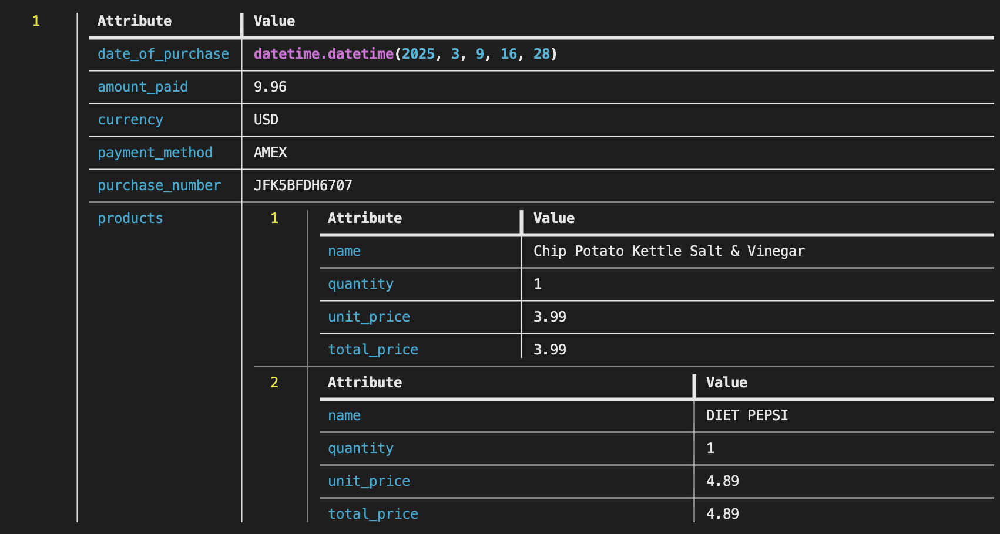

# Extract Proof of Purchase

Extract key information from receipts and invoices.

## Prerequisites

Before running this example, ensure you have set up your environment. See the [Clone and Install](../../../../README.md#1-clone-and-install) section in the main README.

## Run the pipeline

```bash
pipelex run pipe examples/b_basics/document_extract/extract_proof_of_purchase/bundle.mthds -i examples/b_basics/document_extract/extract_proof_of_purchase/inputs.json -L examples/documents
```

## Flowchart



## Expected output




## Go further

You can go further by generating the python structures and runner code out of this bundle in order to add validation functions to the python BaseModel.

```bash
pipelex build runner examples/b_basics/document_extract/extract_proof_of_purchase/bundle.mthds -L examples/documents
```

This will create a new file `examples/b_basics/document_extract/extract_proof_of_purchase/run_extract_proof_of_purchase.py` and a `structures` directory containing the python structures.
