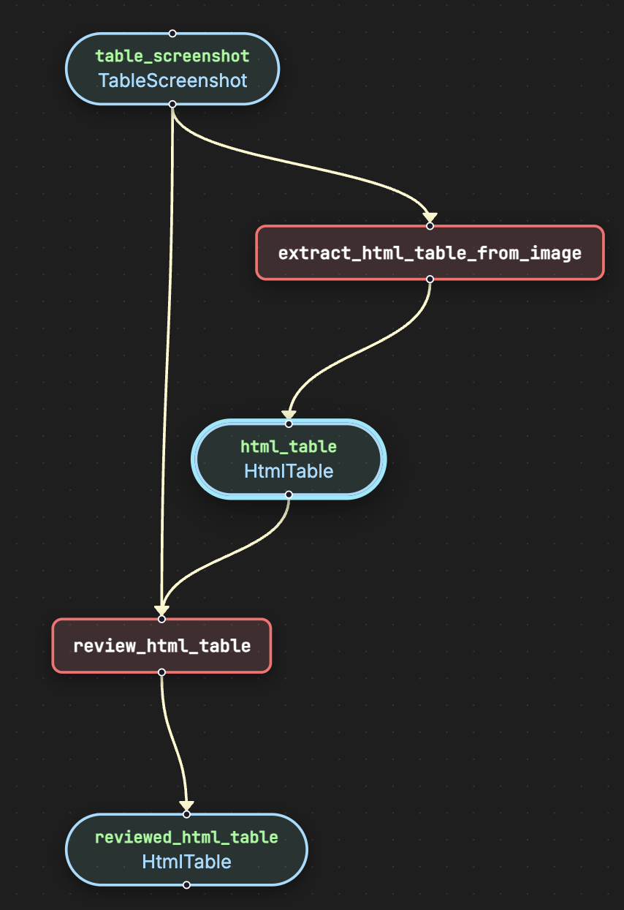
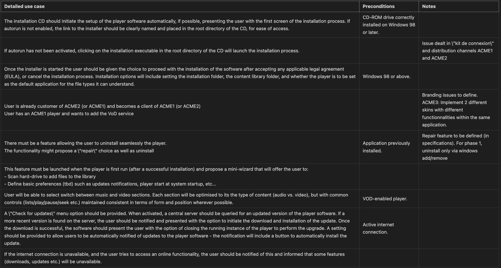

# Extract Table

Extract HTML tables from image screenshots.

## Run the pipeline

```bash
pipelex run examples/b_basics/document_extract/extract_table/bundle.plx -i examples/b_basics/document_extract/extract_table/inputs.json
```

## Flowchart



## Expected output




## Go further

You can go further by generating the python structures and runner code out of this bundle in order to add validation functions to the python BaseModel.

```bash
pipelex build runner examples/b_basics/document_extract/extract_table/bundle.plx
```

This will create a new file `examples/b_basics/document_extract/extract_table/run_extract_table.py` and a `structures` directory containing the python structures.
