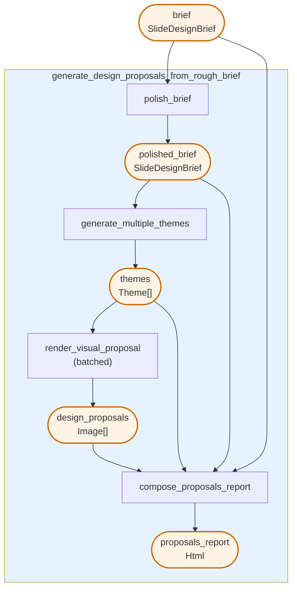

# Design Slides

Generate presentation design proposals from a design brief. This pipeline takes a slide design brief, polishes it, generates multiple theme variations, renders visual mockups, and compiles everything into an HTML report.

## Prerequisites

Before running this example, ensure you have set up your environment. See the [Clone and Install](../../../../README.md#1-clone-and-install) section in the main README.

## Run the pipeline

```bash
pipelex run examples/b_basics/generate_visuals/design_slides/bundle.plx --inputs examples/b_basics/generate_visuals/design_slides/inputs.json
```

## Flowchart



## How it works

1. **polish_brief**: A `PipeLLM` that reviews the client brief and enhances it by filling in missing fields with sensible defaults based on context

2. **generate_multiple_themes**: A `PipeLLM` that creates 3 cohesive visual themes based on the polished brief, each with colors, typography, layout, and style settings

3. **render_visual_proposal**: A `PipeImgGen` that generates visual mockup images for each theme (runs in batch mode, processing all themes in parallel)

4. **compose_proposals_report**: A `PipeCompose` that generates an HTML report presenting all design proposals with theme details and color swatches

## Input

The pipeline expects a `SlideDesignBrief` with the following fields:
- `topic` (required): The main topic or subject of the presentation
- `brand_guidelines`: The client's brand guidelines (colors, fonts, logo usage)
- `brand_personality`: formal, playful, innovative, trustworthy, or artsy
- `existing_references`: Existing templates or past decks to reference
- `goal`: pitch investors, sell to clients, internal training, or keynote
- `audience`: executives, technical team, or general public

## Output

An HTML report containing:
- Original and enhanced brief comparison
- Visual mockups for each design proposal
- Detailed theme specifications with color swatches

## Go further

You can go further by generating the python structures and runner code out of this bundle:

```bash
pipelex build runner examples/b_basics/generate_visuals/design_slides/bundle.plx
```

This will create a new file `examples/b_basics/generate_visuals/design_slides/run_slide_designer.py` and a `structures` directory containing the python structures.
