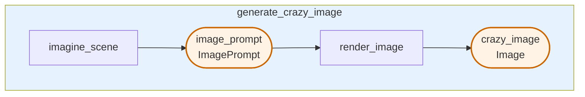

# Generate Crazy Image

Generate absurd, funny images with unexpected surreal elements using a two-step pipeline that first imagines a creative scene concept, then renders it as an image.

## Prerequisites

Before running this example, ensure you have set up your environment. See the [Clone and Install](../../../../README.md#1-clone-and-install) section in the main README.

## Run the pipeline

```bash
pipelex run bundle examples/b_basics/generate_visuals/gen_image/
```

## Flowchart



## How it works

1. **imagine_scene**: A `PipeLLM` that generates a creative, absurd image concept combining unexpected elements in surreal ways (e.g., flying spaghetti monsters, penguins in business suits at a disco, or a T-Rex doing yoga on the moon)

2. **render_image**: A `PipeImgGen` that takes the image prompt and generates the actual image

## Go further

You can go further by generating the python structures and runner code out of this bundle:

```bash
pipelex build runner bundle examples/b_basics/generate_visuals/gen_image/bundle.mthds
```

This will create a new file `examples/b_basics/generate_visuals/gen_image/run_crazy_image_generation.py` and a `structures` directory containing the python structures.
