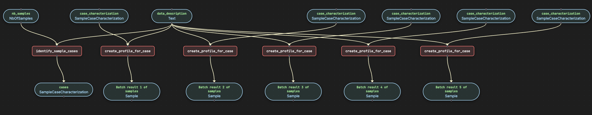
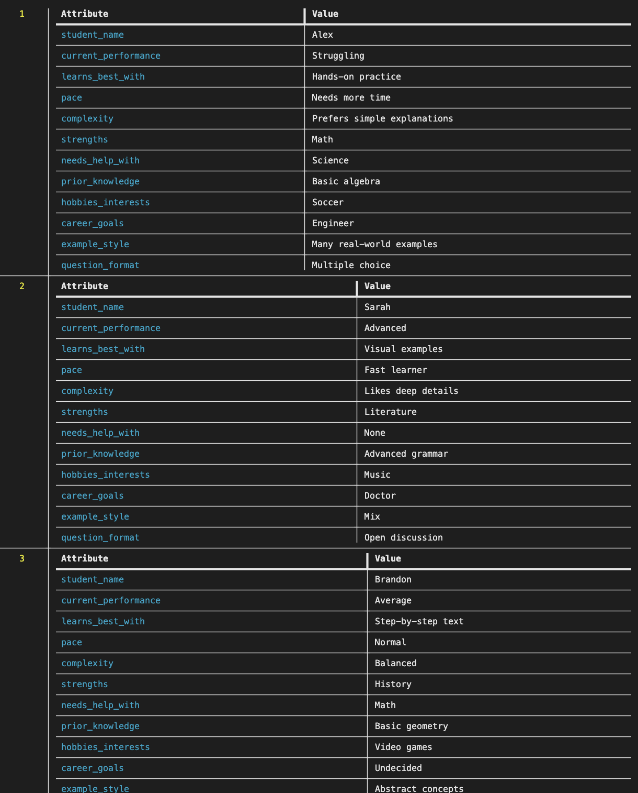

# Generate Synthetic Data

Generate synthetic student profile data based on a schema description.

## Prerequisites

Before running this example, ensure you have set up your environment. See the [Clone and Install](../../../README.md#1-clone-and-install) section in the main README.

## Run the pipeline

```bash
pipelex run bundle examples/c_advanced/gen_synthetic_data/bundle.mthds -i examples/c_advanced/gen_synthetic_data/inputs.json
```

## Flowchart



## Expected output




## Go further

You can go further by generating the python structures and runner code out of this bundle in order to add validation functions to the python BaseModel.

```bash
pipelex build runner bundle examples/c_advanced/gen_synthetic_data/bundle.mthds
```

This will create a new file `examples/c_advanced/gen_synthetic_data/run_gen_synthetic_data.py` and a `structures` directory containing the python structures.
