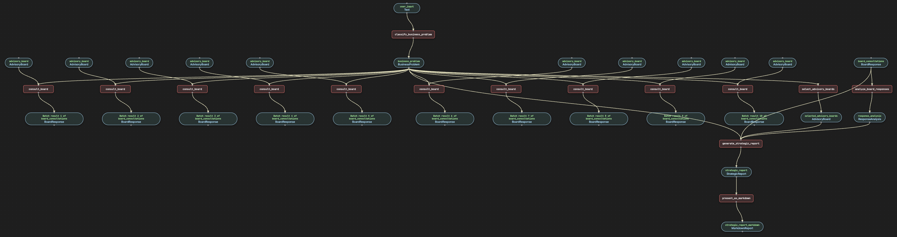
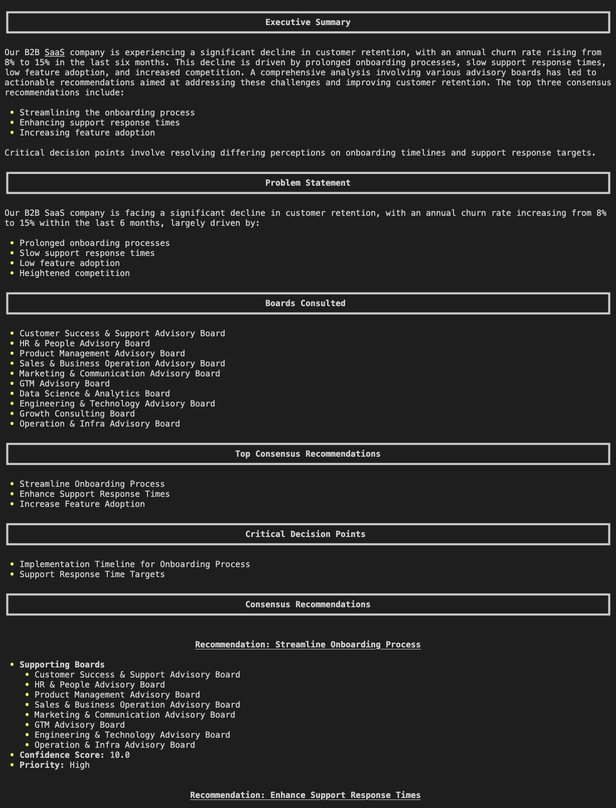

# Advisory Board Orchestrator

A sophisticated multi-advisory board consultation system that analyzes complex business problems by leveraging multiple domain expert perspectives.

## Prerequisites

Before running this example, ensure you have set up your environment. See the [Clone and Install](../../../README.md#1-clone-and-install) section in the main README.

## Run the pipeline

```bash
pipelex run pipe examples/wip/advisory_board/bundle.mthds -i examples/wip/advisory_board/inputs.json -L examples/wip/advisory_board
```

## Flowchart



## Expected output




## Go further

You can go further by generating the python structures and runner code out of this bundle in order to add validation functions to the python BaseModel.

```bash
pipelex build runner examples/wip/advisory_board/bundle.mthds -L examples/wip/advisory_board 
```

This will create a new file `examples/wip/advisory_board/run_master_advisory_orchestrator.py` and a `structures` directory containing the python structures.

---

## What it Does

The Advisory Board Orchestrator:
1. **Analyzes** a business problem and classifies it into a structured format
2. **Selects** the most relevant advisory boards from 16+ available boards based on the problem type
3. **Consults** each selected board to get domain-specific recommendations
4. **Synthesizes** all responses to identify consensus, conflicts, and unique insights
5. **Generates** a comprehensive strategic report with actionable recommendations

## Key Features Demonstrated

- **Complex Pipeline Orchestration**: Uses `PipeSequence` with multiple steps
- **Batch Processing**: Consults multiple advisory boards in parallel using `batch_over`
- **Structured Output**: Generates typed outputs using inline PLX structures
- **Multi-Perspective Analysis**: Synthesizes diverse expert opinions
- **Conflict Resolution**: Identifies and provides frameworks for resolving conflicting advice

## Available Advisory Boards

The system can consult boards including:
- Executive Leadership
- Product Management
- Go-to-Market (GTM)
- Engineering & Technology
- Customer Success & Support
- Finance & Corporate Development
- And 10+ more specialized boards

Each board provides domain-specific analysis and recommendations based on their expertise area.
