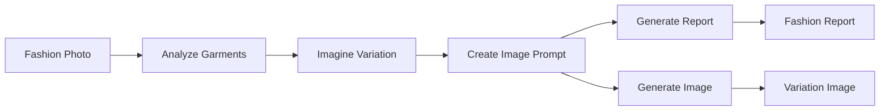

# Fashion Analysis Pipeline 👗

A comprehensive AI pipeline that analyzes fashion photos, identifies garments, imagines creative variations, and generates new images with modified details.

## Overview

This pipeline demonstrates advanced AI capabilities in fashion analysis and design:

1. **Computer Vision Analysis** - Detailed analysis of fashion photographs
2. **Creative Design Variation** - AI-powered imagination of design modifications  
3. **Prompt Engineering** - Sophisticated prompt creation for image generation
4. **Industry Reporting** - Professional fashion industry analysis reports
5. **Image Generation** - Actual image synthesis using Stable Diffusion via Fal.ai

## Features

### 🔍 Fashion Photo Analysis
- Identifies all garments in photos (clothing, shoes, accessories)
- Analyzes materials, colors, patterns, and design details
- Evaluates styling and aesthetic coordination
- Identifies potential modification opportunities

### 🎨 Creative Design Variations
- Generates innovative variations for specific garment details
- Maintains functionality while creating visual impact
- Provides design rationale and feasibility assessment
- Focuses on fashion-forward, commercially viable modifications

### 📝 Professional Reporting
- Executive summaries for stakeholders
- Market potential assessments
- Technical implementation considerations
- Actionable recommendations for fashion professionals

### 🖼️ Image Generation
- Creates actual fashion images with design variations
- Uses state-of-the-art Stable Diffusion models via Fal.ai
- Professional fashion photography styling
- High-resolution, editorial-quality outputs

## Files Structure

```
fashion_analysis/
├── fashion_analysis.toml          # Pipeline configuration
├── fashion_concepts.py            # Data structure definitions
├── fashion_analysis_pipeline.py   # Basic pipeline runner
├── fashion_with_image_generation.py # Enhanced version with image generation
└── README.md                      # This documentation
```

## Setup & Installation

### 1. Prerequisites
```bash
# Ensure you're in the pipelex-cookbook root directory
cd pipelex-cookbook

# Install dependencies (already included)
make install
```

### 2. Environment Setup
```bash
# Copy environment template
cp .env.example .env

# Edit .env and add your API keys:
# - OPENAI_API_KEY (required for analysis)
# - FAL_KEY (optional, for image generation)
```

### 3. For Image Generation (Optional)
To enable actual image generation, you'll need a Fal.ai API key:

1. Sign up at [fal.ai](https://fal.ai)
2. Get your API key
3. Add it to your `.env` file: `FAL_KEY=your_key_here`

## Usage

### Basic Fashion Analysis

```bash
# Analyze with sample description (no image required)
python examples/wip/fashion_analysis/fashion_analysis_pipeline.py

# Analyze a specific image
python examples/wip/fashion_analysis/fashion_analysis_pipeline.py --image-path /path/to/fashion/photo.jpg

# Specify output directory
python examples/wip/fashion_analysis/fashion_analysis_pipeline.py --output-dir ./my_fashion_analysis
```

### Enhanced Analysis with Image Generation

```bash
# Full pipeline with image generation
python examples/wip/fashion_analysis/fashion_with_image_generation.py --generate-image

# Analyze specific image and generate variation
python examples/wip/fashion_analysis/fashion_with_image_generation.py \
  --image-path /path/to/fashion/photo.jpg \
  --generate-image \
  --output-dir ./fashion_results
```

### Command Line Options

| Option | Description |
|--------|-------------|
| `--image-path PATH` | Path to fashion photo (JPG, PNG) or text description (.txt) |
| `--description TEXT` | Optional description of the photo |
| `--generate-image` | Generate actual images using Fal.ai (requires FAL_KEY) |
| `--output-dir DIR` | Directory to save outputs (default: ./fashion_output) |

## Example Workflow

### 1. Input Fashion Photo
```
Professional fashion photography of a woman wearing:
- Navy blue blazer with silver buttons
- White cotton shirt
- Charcoal gray trousers
- Black leather pumps
```

### 2. AI Analysis Output
```
GARMENT ANALYSIS:
- Blazer: Navy blue, notched lapels, structured shoulders
- Shirt: White cotton, button-down, crisp fit
- Trousers: Charcoal gray, high-waisted, straight-leg
- Overall Style: Professional, modern business attire
```

### 3. Creative Variation
```
PROPOSED VARIATION:
- Selected Garment: Navy blue blazer
- Original Detail: Standard notched lapels
- Proposed Variation: Oversized bow collar
- Design Rationale: Adds feminine sophistication while maintaining professionalism
```

### 4. Generated Image
A new fashion photo showing the same outfit but with the blazer featuring an elegant oversized bow collar instead of traditional lapels.

## Pipeline Architecture

The pipeline uses Pipelex's declarative TOML configuration:



### Pipeline Steps

1. **analyze_garments** - Computer vision analysis of the fashion photo
2. **imagine_variation** - Creative design modification generation
3. **create_image_prompt** - Detailed prompt engineering for image generation
4. **generate_fashion_report** - Comprehensive industry report creation

## Output Files

The pipeline generates several output files:

- **Fashion Report** (`fashion_report_YYYYMMDD_HHMMSS.md`) - Comprehensive analysis
- **Generated Image** (`generated_variation_YYYYMMDD_HHMMSS.png`) - Variation image
- **Pipeline Flowchart** - Visual representation of the pipeline execution
- **Cost Report** - Token usage and API costs

## Advanced Usage

### Custom Image Generation Models

The pipeline supports different image generation models via Fal.ai:

```python
# In fashion_with_image_generation.py, modify the model:
result = fal_client.run(
    "fal-ai/flux/dev",  # Higher quality, slower
    # or "fal-ai/flux/schnell",  # Faster generation
    arguments={
        "prompt": image_prompt.prompt_text,
        "image_size": "square_hd",  # or "landscape_4_3", "portrait_4_3"
        "num_inference_steps": 28,  # Higher = better quality
    }
)
```

### Batch Processing

For analyzing multiple fashion photos:

```bash
# Create a script to process multiple images
for image in /path/to/fashion/photos/*.jpg; do
    python examples/wip/fashion_analysis/fashion_with_image_generation.py \
      --image-path "$image" \
      --generate-image \
      --output-dir "./batch_results/$(basename "$image" .jpg)"
done
```

## Integration Examples

### Fashion E-commerce
- Analyze product photos
- Generate style variations
- Create marketing content
- A/B test design modifications

### Fashion Design Studios
- Rapid prototyping of design ideas
- Market research and trend analysis
- Client presentation materials
- Design documentation

### Fashion Education
- Teaching garment analysis
- Design variation exercises
- Fashion photography concepts
- Industry report writing

## Troubleshooting

### Common Issues

**1. "Image file not found"**
- Ensure the image path is correct
- Supported formats: JPG, PNG, GIF
- Use absolute paths if relative paths fail

**2. "FAL_KEY not set"**
- Image generation requires a Fal.ai API key
- Sign up at fal.ai and add the key to your .env file
- Pipeline will work without it but won't generate images

**3. "Pipeline execution failed"**
- Check your OPENAI_API_KEY is set correctly
- Ensure you have sufficient API credits
- Try with a simpler text description first

**4. "Import errors"**
- Run `make install` from the project root
- Ensure you're using the correct Python environment

### Performance Tips

- Use text descriptions for testing (faster, no image processing)
- Set `num_inference_steps=4` for faster image generation
- Use `fal-ai/flux/schnell` model for speed over quality
- Process images in smaller batches to avoid rate limits

## Contributing

To extend this pipeline:

1. **Add new analysis steps** - Modify `fashion_analysis.toml`
2. **Enhance concept definitions** - Update `fashion_concepts.py`
3. **Integrate new models** - Add support for other image generation services
4. **Improve prompts** - Refine the system and user prompts for better results

## License

This pipeline is part of the Pipelex Cookbook and follows the same MIT license.

---

**Happy Fashion Analysis!** 🎨✨