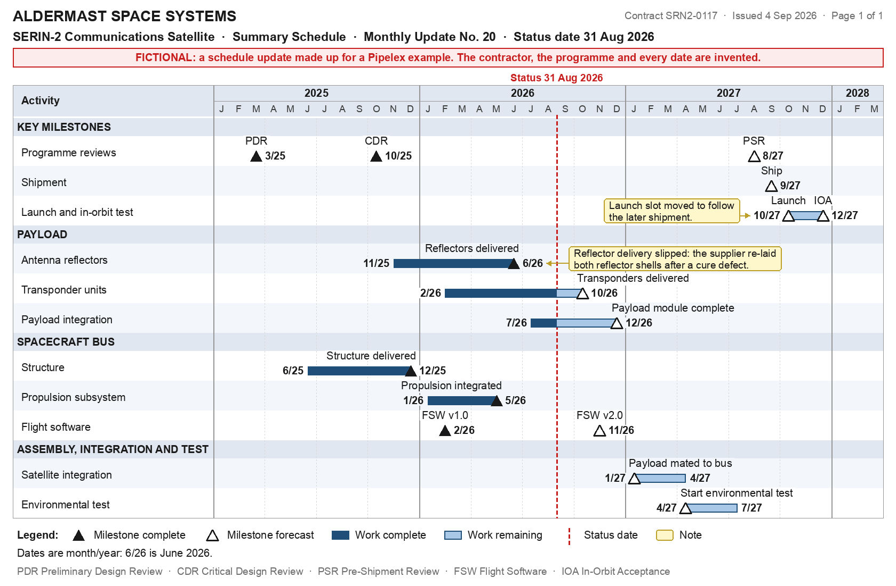

<!-- Generated by `make render` from methods/check_schedule_update/ and cookbook.toml. Edit those, or templates/, and render again; never edit this page by hand. -->

# Schedule update checked against the baseline

Read a contractor's schedule update, the chart its scheduling tool exports, against the company's master schedule baseline and slip tolerance, and return what a project controls analyst loads into the master schedule and sends to the project manager: every task and milestone of the chart as a row with its status and its dates to the month, each baseline milestone compared with the update and flagged under the tolerance with the reason the update gives, and a two-sentence note on what slipped.

`github.com/Pipelex/pipelex-cookbook/check_schedule_update@v0.20.1` · [bundle.mthds](bundle.mthds) · [sample schedule update](https://raw.githubusercontent.com/Pipelex/pipelex-cookbook/main/assets/check_schedule_update/summary_schedule_update.png)

## The sample

**Sample schedule update**



*Fictional, made for this example.* Licence: [MIT](https://github.com/Pipelex/pipelex-cookbook/blob/main/LICENSE). Credit: Evotis S.A.S.

**Sample baseline and tolerance**

> Master schedule baseline and slip tolerance: written for a Pipelex example, not any real company's. The programme, its manufacturer and every date are fictional.
>
> We hold one master schedule for the SERIN-2 satellite programme. The manufacturer's monthly summary schedule update is read against the baseline below, the one agreed at the last rebaseline, and every slip beyond our tolerance goes to the project manager the same day.
>
> Baseline
>
> The month each milestone is due in the master schedule, named as the manufacturer's summary schedule names it.
>
> Programme milestones
> - PDR: March 2025
> - CDR: September 2025
> - PSR: July 2027
> - Ship: August 2027
> - Launch: September 2027
> - IOA: November 2027
>
> Payload
> - Reflectors delivered: April 2026
> - Transponders delivered: September 2026
> - Payload module complete: October 2026
>
> Spacecraft bus
> - Structure delivered: January 2026
> - Propulsion integrated: May 2026
> - FSW v2.0: November 2026
>
> Assembly, integration and test
> - Payload mated to bus: November 2026
> - Start environmental test: March 2027
>
> Tolerance
>
> 1. Dates are compared to the month, as the summary schedule prints them: "6/26" is June 2026. A slip is the number of whole months between the baseline month and the month the update gives.
> 2. A milestone the update shows as complete is compared on the month it was completed; any other milestone on the month the update now forecasts.
> 3. Flag a milestone that slips by more than one month.
> 4. Flag any slip of Ship or Launch, even of one month.
> 5. A milestone forecast earlier than its baseline is early, and is not flagged.
> 6. Flag a baseline milestone the update no longer shows, as missing from the update.
> 7. Every other task and milestone the update shows is carried into the master schedule as it stands, with no baseline to compare it with.
> 8. Where the update gives a reason for a slip, as a callout on the chart, quote it with the flag.

*Written for this example.* Licence: [MIT](https://github.com/Pipelex/pipelex-cookbook/blob/main/LICENSE). Credit: Evotis S.A.S.

## What you get

Run on production on 27 September 2026, from the package's files, in 55 seconds. This is what it returned:

| Field | Value |
|---|---|
| `update` | SERIN-2 Communications Satellite · Summary Schedule · Monthly Update No. 20 — status August 2026 |

**`note_for_project_manager`**

Five milestones are beyond tolerance: Ship, due 2027-08 in the baseline, is 1 month late; Launch, due 2027-09 in the baseline, is 1 month late, with the update stating “Launch slot moved to follow the later shipment.”; Reflectors delivered, due 2026-04 in the baseline, is 2 months late, with the update stating “Reflector delivery slipped: the supplier re-laid both reflector shells after a cure defect.”; Payload module complete, due 2026-10 in the baseline, is 2 months late; and Payload mated to bus, due 2026-11 in the baseline, is 2 months late.  
Within tolerance, CDR, due 2025-09 in the baseline, PSR, due 2027-07 in the baseline, IOA, due 2027-11 in the baseline, Transponders delivered, due 2026-09 in the baseline, and Start environmental test, due 2027-03 in the baseline, are each 1 month late.

**`rows`**

| `group` | `activity` | `item` | `type` | `status` | `start` | `finish` | `baseline` | `slip_months` | `flag` | `reason_given` |
|---|---|---|---|---|---|---|---|---|---|---|
| Key Milestones | Programme Reviews | PDR | milestone | complete |   | 2025-03 | 2025-03 | 0 | on time |   |
| Key Milestones | Programme Reviews | CDR | milestone | complete |   | 2025-10 | 2025-09 | 1 | within tolerance |   |
| Key Milestones | Programme Reviews | PSR | milestone | forecast |   | 2027-08 | 2027-07 | 1 | within tolerance |   |
| Key Milestones | Shipment | Ship | milestone | forecast |   | 2027-09 | 2027-08 | 1 | beyond tolerance |   |
| Key Milestones | Launch And In-Orbit Test | Launch | milestone | forecast |   | 2027-10 | 2027-09 | 1 | beyond tolerance | Launch slot moved to follow the later shipment. |
| Key Milestones | Launch And In-Orbit Test | Launch And In-Orbit Test | task | forecast | 2027-10 | 2027-12 |   |   | no baseline |   |
| Key Milestones | Launch And In-Orbit Test | IOA | milestone | forecast |   | 2027-12 | 2027-11 | 1 | within tolerance |   |
| Payload | Antenna Reflectors | Antenna Reflectors | task | complete | 2025-11 | 2026-06 |   |   | no baseline |   |
| Payload | Antenna Reflectors | Reflectors delivered | milestone | complete |   | 2026-06 | 2026-04 | 2 | beyond tolerance | Reflector delivery slipped: the supplier re-laid both reflector shells after a cure defect. |
| Payload | Transponder Units | Transponder Units | task | forecast | 2026-02 | 2026-10 |   |   | no baseline |   |
| Payload | Transponder Units | Transponders delivered | milestone | forecast |   | 2026-10 | 2026-09 | 1 | within tolerance |   |
| Payload | Payload Integration | Payload Integration | task | forecast | 2026-07 | 2026-12 |   |   | no baseline |   |
| Payload | Payload Integration | Payload module complete | milestone | forecast |   | 2026-12 | 2026-10 | 2 | beyond tolerance |   |
| Spacecraft Bus | Structure | Structure | task | complete | 2025-06 | 2025-12 |   |   | no baseline |   |
| Spacecraft Bus | Structure | Structure delivered | milestone | complete |   | 2025-12 | 2026-01 | -1 | early |   |
| Spacecraft Bus | Propulsion Subsystem | Propulsion Subsystem | task | complete | 2026-01 | 2026-05 |   |   | no baseline |   |
| Spacecraft Bus | Propulsion Subsystem | Propulsion integrated | milestone | complete |   | 2026-05 | 2026-05 | 0 | on time |   |
| Spacecraft Bus | Flight Software | FSW v1.0 | milestone | complete |   | 2026-02 |   |   | no baseline |   |
| Spacecraft Bus | Flight Software | FSW v2.0 | milestone | forecast |   | 2026-11 | 2026-11 | 0 | on time |   |
| Assembly, Integration And Test | Satellite Integration | Payload mated to bus | milestone | forecast |   | 2027-01 | 2026-11 | 2 | beyond tolerance |   |
| Assembly, Integration And Test | Satellite Integration | Satellite Integration | task | forecast | 2027-01 | 2027-04 |   |   | no baseline |   |
| Assembly, Integration And Test | Environmental Test | Start environmental test | milestone | forecast |   | 2027-04 | 2027-03 | 1 | within tolerance |   |
| Assembly, Integration And Test | Environmental Test | Environmental Test | task | forecast | 2027-04 | 2027-07 |   |   | no baseline |   |

**`missing_from_update`**

None.

**Takes**

- `schedule_update`, an image (`ScheduleUpdate`): A contractor's schedule update: the chart its scheduling tool exports, as an image, with a time axis, rows of bars and milestones, and a legend.
- `baseline`, a text (`Baseline`): The master schedule baseline an update is held to: the month each milestone is due, and the tolerance, the rules deciding which slips are flagged.

**Returns** a `ScheduleCheck`: A contractor's schedule update checked against the baseline: a note for the project manager, then the update's tasks and milestones as rows.

- `update`, text: What the update is: its schedule and the date of its status line.
- `note_for_project_manager`, text: Two sentences for the project manager: the milestones that slipped beyond tolerance, by how much and why, then what slipped within it.
- `rows`, a list of `ScheduleRow`: Every task and milestone the update shows, in its order, each compared with the baseline where the baseline holds it.
- `missing_from_update`, a list of `ScheduleRow`: The baseline milestones the update no longer shows, each flagged; empty when it shows them all.

## Try it in your chatbot

With the Pipelex MCP in ChatGPT or Claude ([add it once](https://github.com/Pipelex/pipelex-mcp)), ask:

```text
Run github.com/Pipelex/pipelex-cookbook/check_schedule_update@v0.20.1 on https://raw.githubusercontent.com/Pipelex/pipelex-cookbook/main/assets/check_schedule_update/summary_schedule_update.png, with the other sample inputs in https://raw.githubusercontent.com/Pipelex/pipelex-cookbook/v0.20.1/methods/check_schedule_update/inputs.json
```

In ChatGPT you can attach your own file instead of the link; Claude takes a link. In Claude Code or Codex with the [Pipelex plugin](https://github.com/Pipelex/pipelex-plugins), the same sentence runs through `/pipelex-run`.

## Put it in your code

Each call runs the method on the hosted API with your `PIPELEX_API_KEY` ([create one](https://app.pipelex.com)).

<details>
<summary>TypeScript</summary>

```bash
npm install @pipelex/sdk
```

```ts
import { PipelexApiClient } from "@pipelex/sdk";

const client = new PipelexApiClient({ apiKey: process.env.PIPELEX_API_KEY });
const result = await client.startAndWaitForResult({
  method_ref: "github.com/Pipelex/pipelex-cookbook/check_schedule_update@v0.20.1",
  inputs: {
    schedule_update: {
      url: "https://raw.githubusercontent.com/Pipelex/pipelex-cookbook/main/assets/check_schedule_update/summary_schedule_update.png",
    },
    baseline: {
      text: "Master schedule baseline and slip tolerance: written for a Pipelex example, not any real company's. The programme, its manufacturer and every date are fictional.\n\nWe hold one master schedule for the SERIN-2 satellite programme. The manufacturer's monthly summary schedule update is read against the baseline below, the one agreed at the last rebaseline, and every slip beyond our tolerance goes to the project manager the same day.\n\nBaseline\n\nThe month each milestone is due in the master schedule, named as the manufacturer's summary schedule names it.\n\nProgramme milestones\n- PDR: March 2025\n- CDR: September 2025\n- PSR: July 2027\n- Ship: August 2027\n- Launch: September 2027\n- IOA: November 2027\n\nPayload\n- Reflectors delivered: April 2026\n- Transponders delivered: September 2026\n- Payload module complete: October 2026\n\nSpacecraft bus\n- Structure delivered: January 2026\n- Propulsion integrated: May 2026\n- FSW v2.0: November 2026\n\nAssembly, integration and test\n- Payload mated to bus: November 2026\n- Start environmental test: March 2027\n\nTolerance\n\n1. Dates are compared to the month, as the summary schedule prints them: \"6/26\" is June 2026. A slip is the number of whole months between the baseline month and the month the update gives.\n2. A milestone the update shows as complete is compared on the month it was completed; any other milestone on the month the update now forecasts.\n3. Flag a milestone that slips by more than one month.\n4. Flag any slip of Ship or Launch, even of one month.\n5. A milestone forecast earlier than its baseline is early, and is not flagged.\n6. Flag a baseline milestone the update no longer shows, as missing from the update.\n7. Every other task and milestone the update shows is carried into the master schedule as it stands, with no baseline to compare it with.\n8. Where the update gives a reason for a slip, as a callout on the chart, quote it with the flag.\n",
    },
  },
});
console.log(result.main_stuff);
```

</details>

<details>
<summary>Python</summary>

```bash
pip install pipelex-sdk
```

```python
import asyncio

from pipelex_sdk.client import PipelexAPIClient


async def main() -> None:
    async with PipelexAPIClient() as client:
        result = await client.start_and_wait(
            method_ref="github.com/Pipelex/pipelex-cookbook/check_schedule_update@v0.20.1",
            inputs={
                "schedule_update": {
                    "url": "https://raw.githubusercontent.com/Pipelex/pipelex-cookbook/main/assets/check_schedule_update/summary_schedule_update.png",
                },
                "baseline": {
                    "text": "Master schedule baseline and slip tolerance: written for a Pipelex example, not any real company's. The programme, its manufacturer and every date are fictional.\n\nWe hold one master schedule for the SERIN-2 satellite programme. The manufacturer's monthly summary schedule update is read against the baseline below, the one agreed at the last rebaseline, and every slip beyond our tolerance goes to the project manager the same day.\n\nBaseline\n\nThe month each milestone is due in the master schedule, named as the manufacturer's summary schedule names it.\n\nProgramme milestones\n- PDR: March 2025\n- CDR: September 2025\n- PSR: July 2027\n- Ship: August 2027\n- Launch: September 2027\n- IOA: November 2027\n\nPayload\n- Reflectors delivered: April 2026\n- Transponders delivered: September 2026\n- Payload module complete: October 2026\n\nSpacecraft bus\n- Structure delivered: January 2026\n- Propulsion integrated: May 2026\n- FSW v2.0: November 2026\n\nAssembly, integration and test\n- Payload mated to bus: November 2026\n- Start environmental test: March 2027\n\nTolerance\n\n1. Dates are compared to the month, as the summary schedule prints them: \"6/26\" is June 2026. A slip is the number of whole months between the baseline month and the month the update gives.\n2. A milestone the update shows as complete is compared on the month it was completed; any other milestone on the month the update now forecasts.\n3. Flag a milestone that slips by more than one month.\n4. Flag any slip of Ship or Launch, even of one month.\n5. A milestone forecast earlier than its baseline is early, and is not flagged.\n6. Flag a baseline milestone the update no longer shows, as missing from the update.\n7. Every other task and milestone the update shows is carried into the master schedule as it stands, with no baseline to compare it with.\n8. Where the update gives a reason for a slip, as a callout on the chart, quote it with the flag.\n",
                },
            },
        )
        print(result.main_stuff)


asyncio.run(main())
```

</details>

<details>
<summary>Any HTTP client</summary>

The start call answers at once with the run's id, or with the reason it refused the run; the results call answers 202 while the run is going, 200 with the results once it has completed, and 409 if it failed. The snippet uses `jq` to read the id.

```bash
START=$(curl -s https://api.pipelex.com/v1/start \
  -H "Authorization: Bearer $PIPELEX_API_KEY" -H "Content-Type: application/json" \
  -d '{"method_ref": "github.com/Pipelex/pipelex-cookbook/check_schedule_update@v0.20.1", "inputs": {"schedule_update": {"url": "https://raw.githubusercontent.com/Pipelex/pipelex-cookbook/main/assets/check_schedule_update/summary_schedule_update.png"}, "baseline": {"text": "Master schedule baseline and slip tolerance: written for a Pipelex example, not any real company'\''s. The programme, its manufacturer and every date are fictional.\n\nWe hold one master schedule for the SERIN-2 satellite programme. The manufacturer'\''s monthly summary schedule update is read against the baseline below, the one agreed at the last rebaseline, and every slip beyond our tolerance goes to the project manager the same day.\n\nBaseline\n\nThe month each milestone is due in the master schedule, named as the manufacturer'\''s summary schedule names it.\n\nProgramme milestones\n- PDR: March 2025\n- CDR: September 2025\n- PSR: July 2027\n- Ship: August 2027\n- Launch: September 2027\n- IOA: November 2027\n\nPayload\n- Reflectors delivered: April 2026\n- Transponders delivered: September 2026\n- Payload module complete: October 2026\n\nSpacecraft bus\n- Structure delivered: January 2026\n- Propulsion integrated: May 2026\n- FSW v2.0: November 2026\n\nAssembly, integration and test\n- Payload mated to bus: November 2026\n- Start environmental test: March 2027\n\nTolerance\n\n1. Dates are compared to the month, as the summary schedule prints them: \"6/26\" is June 2026. A slip is the number of whole months between the baseline month and the month the update gives.\n2. A milestone the update shows as complete is compared on the month it was completed; any other milestone on the month the update now forecasts.\n3. Flag a milestone that slips by more than one month.\n4. Flag any slip of Ship or Launch, even of one month.\n5. A milestone forecast earlier than its baseline is early, and is not flagged.\n6. Flag a baseline milestone the update no longer shows, as missing from the update.\n7. Every other task and milestone the update shows is carried into the master schedule as it stands, with no baseline to compare it with.\n8. Where the update gives a reason for a slip, as a callout on the chart, quote it with the flag.\n"}}}')
RUN_ID=$(printf '%s' "$START" | jq -r '.pipeline_run_id // empty')
if [ -z "$RUN_ID" ]; then printf '%s\n' "$START"; else
  until [ "$(curl -s -o results.json -w '%{http_code}' https://api.pipelex.com/v1/runs/$RUN_ID/results \
    -H "Authorization: Bearer $PIPELEX_API_KEY")" != 202 ]; do sleep 5; done
  cat results.json
fi
```

</details>

In a project you already have, ask your agent for `/pipelex-integrate github.com/Pipelex/pipelex-cookbook/check_schedule_update@v0.20.1`: it generates the result's types and writes one typed call.

## Make it an app

```bash
npm create @pipelex/method-app@latest schedule-check-app -- --method github.com/Pipelex/pipelex-cookbook/check_schedule_update@v0.20.1
make -C schedule-check-app serve
```

The form and the result view come from the method's contract. `make serve` prints the app's URL once the page answers, and `make stop` stops it. Your agent does the same with `/pipelex-scaffold`.

## Make it yours

Ask your agent:

```text
Copy github.com/Pipelex/pipelex-cookbook/check_schedule_update@v0.20.1 into ./schedule-check, also return the rows as CSV in the columns the master schedule's scheduling tool imports, prove it on the sample, and save it to my Pipelex account.
```

From then on every door above takes your method's id (`mt_…`) in place of the address, and your chatbot lists it among your methods.

## Run it on your own machine

With the Pipelex runtime and your own provider keys ([set it up](https://docs.pipelex.com/latest/get-started/run-it-yourself/)):

```bash
curl -sLo inputs.json https://raw.githubusercontent.com/Pipelex/pipelex-cookbook/v0.20.1/methods/check_schedule_update/inputs.json
pipelex run method github.com/Pipelex/pipelex-cookbook/check_schedule_update@v0.20.1 --inputs inputs.json
```
