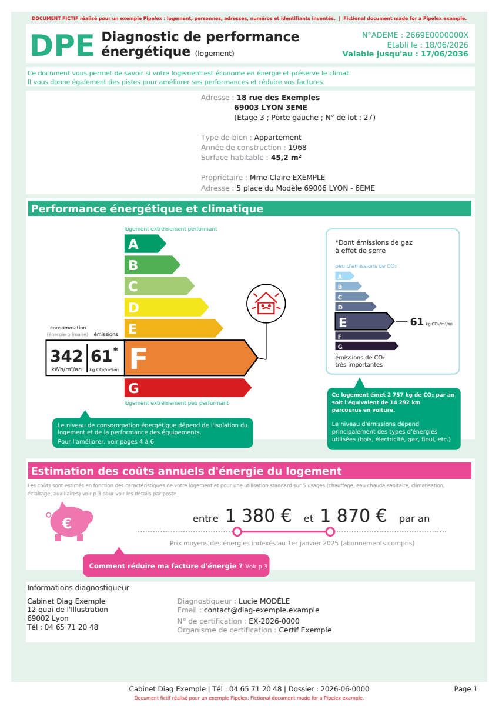

<!-- Generated by `make render` from methods/extract_dpe/ and cookbook.toml. Edit those, or templates/, and render again; never edit this page by hand. -->

# DPE record for a letting agency

Read a French energy performance diagnostic (DPE) and return the record a letting agency files for the flat: the ADEME number and the dates, both classes with their figures, the estimated yearly energy costs with the date their prices refer to, and what the class means for letting the flat under the agency's letting rules.

`github.com/Pipelex/pipelex-cookbook/extract_dpe@v0.19.1` · [bundle.mthds](bundle.mthds) · [sample DPE](https://raw.githubusercontent.com/Pipelex/pipelex-cookbook/main/assets/extract_dpe/synthetic_dpe.pdf)

## The sample

<a href="../../assets/extract_dpe/synthetic_dpe.pdf"></a>

*Fictional, made for this example.* Licence: [MIT](https://github.com/Pipelex/pipelex-cookbook/blob/main/LICENSE). Credit: Evotis S.A.S.

## What you get

Run on production on 27 September 2026, from the package's files, in 24 seconds. This is what it returned:

| Field | Value |
|---|---|
| `address` | 18 rue des Exemples, 69003 LYON 3EME (Étage 3 ; Porte gauche ; N° de lot : 27) |
| `dpe_number` | 2669E0000000X |
| `date_of_issue` | 2026-06-18 |
| `date_of_expiration` | 2036-06-17 |
| `energy_efficiency_class` | F |
| `per_year_per_m2_consumption` | 342 |
| `co2_emission_class` | E |
| `per_year_per_m2_co2_emissions` | 61 |
| `yearly_energy_costs_min` | 1380 |
| `yearly_energy_costs_max` | 1870 |
| `energy_prices_as_of` | 2025-01-01 |
| `letting_status` | Rent frozen; no new or renewed lease from 1 January 2028 |
| `no_new_lease_from` | 2028-01-01 |

**Takes** `document`, a document (`DpeDocument`): A French energy performance diagnostic (DPE) of a dwelling, as a PDF.

**Returns** a `DpeRecord`: The record a letting agency files for a DPE: the figures its listing and property software need, and what the class means for letting the dwelling.

- `address`, text: The address of the dwelling the diagnostic is about, on one line, with its postcode and town, and its floor, door and lot number when the DPE gives them.
- `dpe_number`, text: The DPE's number in the ADEME register, by which it can be checked.
- `date_of_issue`, a date: The date the DPE was drawn up.
- `date_of_expiration`, a date: The date the DPE is valid until.
- `energy_efficiency_class`, text: The dwelling's DPE class, the one the energy and climate label gives it.
- `per_year_per_m2_consumption`, an integer: Primary energy consumption, in kWh per m² per year.
- `co2_emission_class`, text: The greenhouse gas emission class, read on the CO₂ emissions scale.
- `per_year_per_m2_co2_emissions`, an integer: Greenhouse gas emissions, in kg of CO₂ per m² per year.
- `yearly_energy_costs_min`, an integer: The low end of the estimated yearly energy costs, in euros.
- `yearly_energy_costs_max`, an integer: The high end of the estimated yearly energy costs, in euros.
- `energy_prices_as_of`, a date: The date the energy prices of the cost estimate are indexed to.
- `letting_status`, text: What the class means for letting on mainland France's calendar: the standard met, or the date that bars a new or renewed lease and whether the rent is frozen; overseas, the calendar to check.
- `no_new_lease_from`, a date: The date from which the class bars a lease signed, renewed or tacitly renewed, on mainland France's calendar; empty when no date bars it, or when the dwelling is overseas.

## Try it in your chatbot

With the Pipelex MCP in ChatGPT or Claude ([add it once](https://github.com/Pipelex/pipelex-mcp)), ask:

```text
Run github.com/Pipelex/pipelex-cookbook/extract_dpe@v0.19.1 on https://raw.githubusercontent.com/Pipelex/pipelex-cookbook/main/assets/extract_dpe/synthetic_dpe.pdf
```

In ChatGPT you can attach your own file instead of the link; Claude takes a link. In Claude Code or Codex with the [Pipelex plugin](https://github.com/Pipelex/pipelex-plugins), the same sentence runs through `/pipelex-run`.

## Put it in your code

Each call runs the method on the hosted API with your `PIPELEX_API_KEY` ([create one](https://app.pipelex.com)).

<details>
<summary>TypeScript</summary>

```bash
npm install @pipelex/sdk
```

```ts
import { PipelexApiClient } from "@pipelex/sdk";

const client = new PipelexApiClient({ apiKey: process.env.PIPELEX_API_KEY });
const result = await client.startAndWaitForResult({
  method_ref: "github.com/Pipelex/pipelex-cookbook/extract_dpe@v0.19.1",
  inputs: {
    document: {
      url: "https://raw.githubusercontent.com/Pipelex/pipelex-cookbook/main/assets/extract_dpe/synthetic_dpe.pdf",
    },
  },
});
console.log(result.main_stuff);
```

</details>

<details>
<summary>Python</summary>

```bash
pip install pipelex-sdk
```

```python
import asyncio

from pipelex_sdk.client import PipelexAPIClient


async def main() -> None:
    async with PipelexAPIClient() as client:
        result = await client.start_and_wait(
            method_ref="github.com/Pipelex/pipelex-cookbook/extract_dpe@v0.19.1",
            inputs={
                "document": {
                    "url": "https://raw.githubusercontent.com/Pipelex/pipelex-cookbook/main/assets/extract_dpe/synthetic_dpe.pdf",
                },
            },
        )
        print(result.main_stuff)


asyncio.run(main())
```

</details>

<details>
<summary>Any HTTP client</summary>

The start call answers at once with the run's id, or with the reason it refused the run; the results call answers 202 while the run is going, 200 with the results once it has completed, and 409 if it failed. The snippet uses `jq` to read the id.

```bash
START=$(curl -s https://api.pipelex.com/v1/start \
  -H "Authorization: Bearer $PIPELEX_API_KEY" -H "Content-Type: application/json" \
  -d '{"method_ref": "github.com/Pipelex/pipelex-cookbook/extract_dpe@v0.19.1", "inputs": {"document": {"url": "https://raw.githubusercontent.com/Pipelex/pipelex-cookbook/main/assets/extract_dpe/synthetic_dpe.pdf"}}}')
RUN_ID=$(printf '%s' "$START" | jq -r '.pipeline_run_id // empty')
if [ -z "$RUN_ID" ]; then printf '%s\n' "$START"; else
  until [ "$(curl -s -o results.json -w '%{http_code}' https://api.pipelex.com/v1/runs/$RUN_ID/results \
    -H "Authorization: Bearer $PIPELEX_API_KEY")" != 202 ]; do sleep 5; done
  cat results.json
fi
```

</details>

In a project you already have, ask your agent for `/pipelex-integrate github.com/Pipelex/pipelex-cookbook/extract_dpe@v0.19.1`: it generates the result's types and writes one typed call.

## Make it an app

```bash
npm create @pipelex/method-app@latest dpe-app -- --method github.com/Pipelex/pipelex-cookbook/extract_dpe@v0.19.1
make -C dpe-app serve
```

The form and the result view come from the method's contract. `make serve` prints the app's URL once the page answers, and `make stop` stops it. Your agent does the same with `/pipelex-scaffold`.

## Make it yours

Ask your agent:

```text
Copy github.com/Pipelex/pipelex-cookbook/extract_dpe@v0.19.1 into ./dpe, add a short note to the owner saying what the class means for letting the flat and by when to plan the works, prove it on the sample, and save it to my Pipelex account.
```

From then on every door above takes your method's id (`mt_…`) in place of the address, and your chatbot lists it among your methods.

## Run it on your own machine

With the Pipelex runtime and your own provider keys ([set it up](https://docs.pipelex.com/latest/get-started/run-it-yourself/)):

```bash
curl -sLo inputs.json https://raw.githubusercontent.com/Pipelex/pipelex-cookbook/v0.19.1/methods/extract_dpe/inputs.json
pipelex run method github.com/Pipelex/pipelex-cookbook/extract_dpe@v0.19.1 --inputs inputs.json
```
