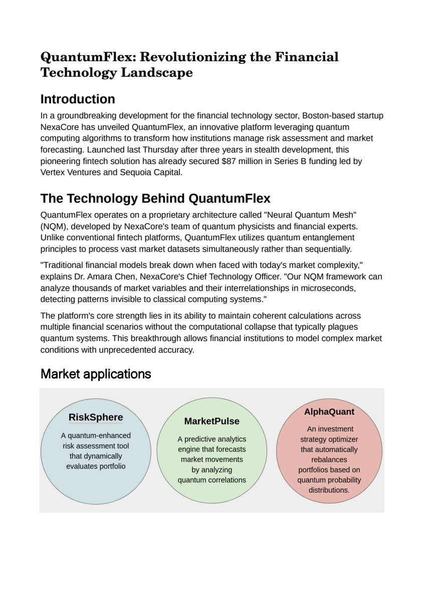

<!-- Generated by `make render` from methods/extract_generic/ and cookbook.toml. Edit those, or templates/, and render again; never edit this page by hand. -->

# Generic document extraction

Read any document and return each page as Markdown, including the text that only appears inside its images and diagrams.

`github.com/Pipelex/pipelex-cookbook/extract_generic@v0.19.1` · [bundle.mthds](bundle.mthds) · [sample article](https://raw.githubusercontent.com/Pipelex/pipelex-cookbook/main/assets/extract_generic/fintech_article_with_text_in_images.pdf)

## The sample

<a href="../../assets/extract_generic/fintech_article_with_text_in_images.pdf"></a>

*Fictional, made for this example.* Licence: [MIT](https://github.com/Pipelex/pipelex-cookbook/blob/main/LICENSE). Credit: Evotis S.A.S.

## What you get

Run on production on 26 September 2026, from the package's files, in 16 seconds. This is what it returned:

### Page 1

#### QuantumFlex: Revolutionizing the Financial Technology Landscape

##### Introduction

In a groundbreaking development for the financial technology sector, Boston-based startup NexaCore has unveiled QuantumFlex, an innovative platform leveraging quantum computing algorithms to transform how institutions manage risk assessment and market forecasting. Launched last Thursday after three years in stealth development, this pioneering fintech solution has already secured $87 million in Series B funding led by Vertex Ventures and Sequoia Capital.

##### The Technology Behind QuantumFlex

QuantumFlex operates on a proprietary architecture called "Neural Quantum Mesh" (NQM), developed by NexaCore's team of quantum physicists and financial experts. Unlike conventional fintech platforms, QuantumFlex utilizes quantum entanglement principles to process vast market datasets simultaneously rather than sequentially.

"Traditional financial models break down when faced with today's market complexity," explains Dr. Amara Chen, NexaCore's Chief Technology Officer. "Our NQM framework can analyze thousands of market variables and their interrelationships in microseconds, detecting patterns invisible to classical computing systems."

The platform's core strength lies in its ability to maintain coherent calculations across multiple financial scenarios without the computational collapse that typically plagues quantum systems. This breakthrough allows financial institutions to model complex market conditions with unprecedented accuracy.

##### Market applications

| **RiskSphere** | **MarketPulse** | **AlphaQuant** |
|:---:|:---:|:---:|
| A quantum-enhanced risk assessment tool that dynamically evaluates portfolio | A predictive analytics engine that forecasts market movements by analyzing quantum correlations | An investment strategy optimizer that automatically rebalances portfolios based on quantum probability distributions. |

### Page 2

#### Industry Response

The financial industry has responded with both enthusiasm and caution. Marcus Blakely, financial technology analyst at Goldman Sachs, describes QuantumFlex as “potentially the most significant leap in financial technology since algorithmic trading,” while warning that “the regulatory framework for quantum-based financial tools remains underdeveloped.”

The Financial Technology Association has announced plans to establish a Quantum Finance Working Group to address emerging concerns about algorithmic transparency and the potential for quantum-speed market manipulation.

#### Future Developments

NexaCore has announced an ambitious roadmap for QuantumFlex, including plans to extend the platform to retail banking applications by Q3 2024. CEO Vanessa Rodriguez highlighted the democratizing potential of the technology: “Our vision extends beyond institutional finance. Within eighteen months, we intend to bring quantum-enhanced financial planning to individual consumers through partnerships with major retail banks.”

The company is also developing a cloud-based API that would allow third-party developers to build applications on the QuantumFlex framework, potentially spawning an entirely new ecosystem of quantum-enhanced financial services.

#### Challenges and Concerns

Despite the enthusiasm, QuantumFlex faces significant challenges. Regulatory bodies including the SEC have expressed interest in understanding how quantum financial technologies might impact market stability. Questions about algorithm explainability—a persistent issue with quantum computing—have also been raised.

Cybersecurity experts like Dr. Jason Mendoza of CyberDefend Institute have pointed out potential vulnerabilities: “Quantum computing offers unprecedented processing power, but it also introduces new attack vectors. Financial institutions adopting these technologies need to simultaneously upgrade their security postures.”

#### Conclusion

Whether QuantumFlex represents the future of financial technology or merely an impressive technological experiment remains to be seen. What’s certain is that NexaCore has pushed the boundaries of what’s possible in the fintech space, potentially changing how financial institutions approach everything from risk management to investment strategy.

As quantum computing continues to mature, QuantumFlex stands as an early example of how this revolutionary technology might transform one of the world’s most data-intensive industries.

**Takes** `document`, a document (`Document`).

**Returns** a list of `Text`.

## Try it in your chatbot

With the Pipelex MCP in ChatGPT or Claude ([add it once](https://github.com/Pipelex/pipelex-mcp)), ask:

```text
Run github.com/Pipelex/pipelex-cookbook/extract_generic@v0.19.1 on https://raw.githubusercontent.com/Pipelex/pipelex-cookbook/main/assets/extract_generic/fintech_article_with_text_in_images.pdf
```

In ChatGPT you can attach your own file instead of the link; Claude takes a link. In Claude Code or Codex with the [Pipelex plugin](https://github.com/Pipelex/pipelex-plugins), the same sentence runs through `/pipelex-run`.

## Put it in your code

Each call runs the method on the hosted API with your `PIPELEX_API_KEY` ([create one](https://app.pipelex.com)).

<details>
<summary>TypeScript</summary>

```bash
npm install @pipelex/sdk
```

```ts
import { PipelexApiClient } from "@pipelex/sdk";

const client = new PipelexApiClient({ apiKey: process.env.PIPELEX_API_KEY });
const result = await client.startAndWaitForResult({
  method_ref: "github.com/Pipelex/pipelex-cookbook/extract_generic@v0.19.1",
  inputs: {
    document: {
      url: "https://raw.githubusercontent.com/Pipelex/pipelex-cookbook/main/assets/extract_generic/fintech_article_with_text_in_images.pdf",
    },
  },
});
console.log(result.main_stuff);
```

</details>

<details>
<summary>Python</summary>

```bash
pip install pipelex-sdk
```

```python
import asyncio

from pipelex_sdk.client import PipelexAPIClient


async def main() -> None:
    async with PipelexAPIClient() as client:
        result = await client.start_and_wait(
            method_ref="github.com/Pipelex/pipelex-cookbook/extract_generic@v0.19.1",
            inputs={
                "document": {
                    "url": "https://raw.githubusercontent.com/Pipelex/pipelex-cookbook/main/assets/extract_generic/fintech_article_with_text_in_images.pdf",
                },
            },
        )
        print(result.main_stuff)


asyncio.run(main())
```

</details>

<details>
<summary>Any HTTP client</summary>

The start call answers at once with the run's id, or with the reason it refused the run; the results call answers 202 while the run is going, 200 with the results once it has completed, and 409 if it failed. The snippet uses `jq` to read the id.

```bash
START=$(curl -s https://api.pipelex.com/v1/start \
  -H "Authorization: Bearer $PIPELEX_API_KEY" -H "Content-Type: application/json" \
  -d '{"method_ref": "github.com/Pipelex/pipelex-cookbook/extract_generic@v0.19.1", "inputs": {"document": {"url": "https://raw.githubusercontent.com/Pipelex/pipelex-cookbook/main/assets/extract_generic/fintech_article_with_text_in_images.pdf"}}}')
RUN_ID=$(printf '%s' "$START" | jq -r '.pipeline_run_id // empty')
if [ -z "$RUN_ID" ]; then printf '%s\n' "$START"; else
  until [ "$(curl -s -o results.json -w '%{http_code}' https://api.pipelex.com/v1/runs/$RUN_ID/results \
    -H "Authorization: Bearer $PIPELEX_API_KEY")" != 202 ]; do sleep 5; done
  cat results.json
fi
```

</details>

In a project you already have, ask your agent for `/pipelex-integrate github.com/Pipelex/pipelex-cookbook/extract_generic@v0.19.1`: it generates the result's types and writes one typed call.

## Make it an app

```bash
npm create @pipelex/method-app@latest extract-app -- --method github.com/Pipelex/pipelex-cookbook/extract_generic@v0.19.1
make -C extract-app serve
```

The form and the result view come from the method's contract. `make serve` prints the app's URL once the page answers, and `make stop` stops it. Your agent does the same with `/pipelex-scaffold`.

## Make it yours

Ask your agent:

```text
Copy github.com/Pipelex/pipelex-cookbook/extract_generic@v0.19.1 into ./extract, turn the tables it finds into CSV alongside the Markdown, prove it on the sample, and save it to my Pipelex account.
```

From then on every door above takes your method's id (`mt_…`) in place of the address, and your chatbot lists it among your methods.

## Run it on your own machine

With the Pipelex runtime and your own provider keys ([set it up](https://docs.pipelex.com/latest/get-started/run-it-yourself/)):

```bash
curl -sLo inputs.json https://raw.githubusercontent.com/Pipelex/pipelex-cookbook/v0.19.1/methods/extract_generic/inputs.json
pipelex run method github.com/Pipelex/pipelex-cookbook/extract_generic@v0.19.1 --inputs inputs.json
```
