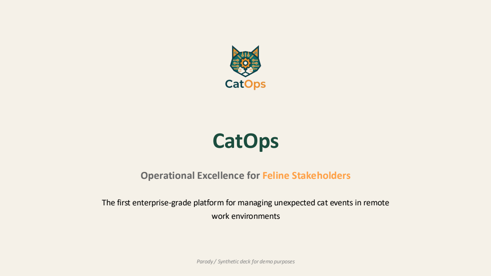

<!-- Generated by `make render` from methods/extract_slides/ and cookbook.toml. Edit those, or templates/, and render again; never edit this page by hand. -->

# Slide deck extraction

Read a slide deck in PDF and return one Markdown text giving each slide its title, its text and a description of its layout and charts.

`github.com/Pipelex/pipelex-cookbook/extract_slides@v0.19.1` · [bundle.mthds](bundle.mthds) · [sample deck](https://raw.githubusercontent.com/Pipelex/pipelex-cookbook/main/assets/presentations/CatOps.pdf)

## The sample

<a href="../../assets/presentations/CatOps.pdf"></a>

*Fictional, made for this example.* Licence: [MIT](https://github.com/Pipelex/pipelex-cookbook/blob/main/LICENSE). Credit: Evotis S.A.S.

## What you get

Run on production on 26 September 2026, from the package's files, in 28 seconds. This is what it returned:

<details>
<summary>The text</summary>

### CatOps

**Operational Excellence for Feline Stakeholders**

The first enterprise-grade platform for managing unexpected cat events in remote work environments

*Parody / Synthetic deck for demo purposes*

> **Description:**
Minimalist title slide on a warm off-white background. At the top center is a stylized cat-head logo incorporating circuit traces and a central gear, in dark teal and orange, with a small “CatOps” wordmark beneath it. The large dark-teal title “CatOps” is centered in the upper-middle. Below it is a bold subtitle, “Operational Excellence for Feline Stakeholders,” with most text in gray and “Feline Stakeholders” highlighted in orange. A centered two-line description appears underneath in black. At the bottom center, a small italic gray disclaimer reads “Parody / Synthetic deck for demo purposes.”

---


### Remote Work Has a Hidden Operational Crisis

**73%** of remote workers report daily "unexpected cat events" disrupting productivity, creating a massive hidden tax on enterprise efficiency.

**Lost Productivity (Per Incident)**  
**47 Minutes**

**Meeting Duration Impact**  
**3.2x Increase**

**Annual Cost to Enterprises**  
**$12.3 Billion**

- **Keyboard Takeovers:** Occur most frequently during deadline-sensitive work.
- **Cable Sabotage:** 89% of incidents happen during investor calls.
- **Current Strategy:** "Hope" and "Closing Doors" are failing at scale.

Figure 1: Typical P0 Incident - Critical Infrastructure Sabotage

> **Description:**
A clean, two-column slide on an off-white background. A large dark teal headline sits at the top left, followed by a two-line introductory statement with “73%” highlighted in orange. The lower-left column contains three stacked pale peach metric cards, each with a thin orange vertical accent line and dark teal labels and values. Beneath the cards is a three-item bulleted list with orange bullets and bold lead-in phrases; in the rendered slide, parts of the bullet text visibly overlap or duplicate, indicating a layout/rendering issue. The right half features a large rounded-corner photograph of a tabby cat biting a damaged cable on a desk, with a note reading “NEVER AGAIN” in the foreground. A small centered gray caption appears beneath the image: “Figure 1: Typical P0 Incident - Critical Infrastructure Sabotage.”

---


### Current Solutions Don't Scale to Enterprise Needs

Source: Global Feline Operations Survey, 2025

Legacy approaches fail to address root causes. **"Hope"** and **"Bribery"** lack the systematic incident prevention required for modern DevOps.

- **"Hope":** Passive strategy with 0% success rate and no measurable ROI.
- **"Closing the Door":** Creates psychological distress and increased vocalizations (meowing).
- **"Bribery with Treats":** Creates dependency loops and escalating demands.
- **"Reactive Scritching":** Addresses symptoms, not root causes; unscalable.

> **Description:**
A two-column slide on an off-white background with a large dark-teal title across the top. The left column contains a horizontal bar chart titled “Failure Rates of Traditional Methods,” using pale orange bars and a 0–100% failure-rate scale. The categories and displayed values are: “Hope” Strategy, about 99%; Closing the Door, 85%; Bribery (Treats), 60%; Reactive Scritching, 45%; Decoy Keyboard, 30%; and Spray Bottle (Legacy), 95%. A small source line sits below the chart. The right column begins with a wide, rounded-corner, heavily blurred photograph dominated by a dark horizontal screen or monitor edge and indistinct background shapes. Beneath it is a short explanatory paragraph, followed by four vertically stacked callouts. Each callout has a small orange icon inside a pale circular badge and a bold dark-teal method name followed by its consequence; highlighted terms in the introductory paragraph are orange.

---


### CatOps Delivers End-to-End Incident Management

Our four-stage platform transforms cat events from chaos to **controlled, predictable operations**, ensuring business continuity even during peak zoomies.

##### 1. Detect & Triage

- **Real-time Monitoring:** Keyboard pressure & webcam motion sensors (0.3s latency).
- **Severity Scoring:** ML assigns P0 (Critical) to P4 (Info) based on meeting context.

##### 2. Resolve & Prevent

- **Automated Response:** Deploys treats, lasers, or calming audio protocols.
- **Predictive Analysis:** Forecasts high-risk periods to preemptively distract felines.

Integrated dashboard provides real-time visibility across all cat-related operational metrics with customizable alerting thresholds.

Source: CatOps Platform Data, Q4 2025 (N=12,300 Incidents)

> **Description:**
Wide slide on an off-white background with a two-column layout. The dark green title spans the upper left. Below it, the left column contains a three-line introductory statement, with “controlled, predictable operations” highlighted in orange. Two stacked pale peach process cards follow, each marked by a thin orange vertical rule at the left: “1. Detect & Triage” and “2. Resolve & Prevent.” Each card contains two dark green bullet points with bold lead-in labels, though the rendered labels and body text visibly overlap. A two-line dashboard statement sits beneath the cards.

The right column contains a donut chart titled “Incident Outcome Distribution.” The chart has four segments: green “Proactively Prevented” as the largest portion (about 45%); blue “Auto-Resolved (Treats)” (about 30%); orange “Auto-Resolved (Laser)” (about 20%); and red “Human Intervention Required” as the smallest portion (about 5%). A vertical legend appears to the chart’s right, and the source note is centered below the chart.

---


### Enterprise-Grade Modules for Complete Cat Operations

Six core modules provide comprehensive coverage of all feline operational scenarios, from **detection** to **prevention**.

##### Incident Console
Centralized command center for real-time tracking and escalation management.

##### Purrformance Dashboard
Analytics suite tracking Mean Time To Scritch (MTTS) and Treat Efficiency.

##### Treat Orchestrator
Automated reward distribution with inventory management and expiration tracking.

##### Cat-Access Control
Role-based permissions defining room access during critical meeting windows.

##### Playbook Library
Pre-built response templates for Zoom bombing, keyboard sitting, and zoomies.

##### Meowtem Analysis
Post-incident review framework for documenting root causes and lessons learned.

##### Integration Ecosystem
Slack / Microsoft Teams

Zoom / Google Meet

Smart Home (Alexa/HomeKit)

Auto-Feeder APIs

##### Technical Specs
< 300ms Detection Latency

99.9% Uptime SLA

SOC 2 Type II Compliant

End-to-End Encryption

> **Description:**
A clean, enterprise-style slide on a warm off-white background. A large dark-teal title spans the upper left, followed by a one-line subtitle in dark gray with the words “detection” and “prevention” highlighted in orange. The main content uses a two-column grid of six outlined white module cards arranged in three rows. Each card contains a pale peach icon tile on the left, a bold dark-teal module name, and a short gray description. The icons depict a monitor, analytics chart, treat/cookie, fingerprint, open book, and review/microscope-like symbol. On the right is a vertical sidebar: a large white bordered panel displaying the stylized CatOps cat-head logo and wordmark, followed by two pale peach information panels with orange left borders for “Integration Ecosystem” and “Technical Specs.”

---


### Intelligent Workflow Reduces Response Time by 84%

1. **Event Intake**
2. **Severity Scoring**
3. **Playbook Selection**
4. **Automated Response**
5. **Verification**
6. **Meowtem Generation**

##### 1. Detection & Triage
Sensors detect anomalies (keyboard pressure, cable vibration) in **0.3 seconds**. ML algorithms assign severity (P0-P4) based on meeting context.

##### 2. Automated Resolution
System instantly deploys countermeasures: treat dispensers, laser distractions, or calming audio to neutralize the threat without human intervention.

##### 3. Continuous Learning
Every incident generates a "Meowtem" (Post-Mortem). Data feeds back into the model to predict and prevent future disruptions.

##### Impact Metric
Average response time reduced from **8.4 minutes** (manual) to **1.3 minutes** (automated), saving approx. 200 hours per year per team.

> **Description:**
A clean, two-column slide on an off-white background. The title spans the top in large dark teal type, with “84%” highlighted in orange. The left half contains a six-step workflow diagram arranged in two rows of three outlined square cards. Each card has a dark teal numbered circle at its upper-left corner, an orange icon, and a centered label. Teal-gray arrows connect the top row from Event Intake to Severity Scoring to Playbook Selection, then point downward to Automated Response and continue right-to-left through Verification to Meowtem Generation, forming a serpentine sequence. The right half contains three stacked pale peach explanation panels, each marked by a thin orange vertical rule and a bold dark teal heading. Beneath them is a white, thin-bordered Impact Metric box with a small green chart icon, a bold heading, and the response-time improvement statement. The overall palette is dark teal, orange, pale peach, gray, and white.

---


### $47B Addressable Market in Remote Work Infrastructure

Source: Gartner Magic Quadrant for Feline Operations, 2026

CatOps targets **127M** knowledge workers with cats globally. The market is growing at a **23% CAGR** driven by permanent remote work policies.

**TAM: $47 Billion**

Total Addressable Market: 127M remote workers × $370 avg annual value.

**SAM: $14.1 Billion**

Serviceable Addressable Market: 38M workers in organizations with 50+ employees.

**SOM: $1.4 Billion**

Serviceable Obtainable Market: 3.8M early adopters in Tech & Finance sectors.

**Expansion: $89 Billion**

Adjacent opportunities in DogOps, BirdOps, and general Pet DevOps.

> **Description:**
A two-column market-sizing slide on an off-white background. Across the top, a large dark-teal headline states the addressable-market message. The left side contains a line chart titled “Projected Market Growth (USD Billions).” It compares Pet DevOps Market Size (blue, with a light-blue shaded area beneath it) against Remote Work Tools (orange) from 2024 through 2030. The blue series rises from roughly $47B in 2024 to about $162B in 2030, with intermediate values around $57B, $70B, $87B, $107B, and $132B. The orange series grows from about $30B to about $69B, passing approximately $34B, $39B, $45B, $52B, and $60B. The vertical axis is Market Size (USD Billions), and the horizontal axis is Year. A centered source line appears below the chart, followed by a two-line summary statement in dark teal with “127M” and “23% CAGR” highlighted in orange.

The right side begins with a large white, thin-bordered panel featuring the centered CatOps logo: a stylized teal-and-orange robotic cat head above the wordmark, with “Cat” in teal and “Ops” in orange. Beneath it is a 2×2 grid of pale-peach market-sizing cards, each marked by a narrow orange vertical bar on its left edge. The cards present TAM ($47 Billion), SAM ($14.1 Billion), SOM ($1.4 Billion), and Expansion ($89 Billion), with a bold dark-teal heading and supporting explanatory text.

---


### Flexible Pricing Scales from Solopreneurs to Enterprises

Source: CatOps Pricing Strategy & Value Analysis, 2026

Our three-tier model with premium add-ons captures value across all segments, from single-cat households to global enterprises with thousands of feline stakeholders.

##### Free (1 Cat)
Basic incident detection, manual playbooks, and community support. Ideal for individual contributors.

##### Pro ($29/mo)
Up to 5 cats. Automated responses, advanced analytics, and priority support for small teams.

##### Enterprise (Custom)
Unlimited whiskers. White-glove onboarding, custom playbooks, dedicated CSM, and SSO integration.

##### Premium Add-Ons
24/7 Scritch Support ($99/mo) and Cat SSO ($199/mo) for unified multi-cat authentication.

> **Description:**
Off-white slide with a large dark-teal title across the top. The left half contains a grouped vertical bar chart titled “Value Proposition by Tier,” comparing Feature Completeness Score (blue) and Support Level Index (orange) across Free Tier, Pro Tier, and Enterprise Tier. The values shown are approximately 30 and 20 for Free, 75 and 60 for Pro, and 100 and 95 for Enterprise. The chart has a vertical axis labeled “Value Index.” A centered source line appears beneath it, followed by a large three-line takeaway statement in dark teal, with “single-cat households” highlighted in orange. The upper-right contains a wide white framed panel with the CatOps cat-head logo centered. Below it are four pale-peach pricing cards arranged in a 2×2 grid, each with a narrow orange accent line on its left edge: Free and Pro on the top row, Enterprise and Premium Add-Ons on the bottom row.

---


### Early Traction Validates Product-Market Fit

**2,400** organizations deployed CatOps in beta, demonstrating strong adoption and measurable impact on remote work productivity.

**847k**  
Paws Per Quarter

**12,300**  
Incidents Resolved

**67%**  
Reduction in Disruptions

**4.8/5.0**  
Customer Satisfaction

**$2.1M ARR**  
Growing 40% MoM with 118% Net Revenue Retention

Source: CatOps Platform Analytics, 2025

> **Description:**
Off-white slide with a dark teal title at the upper left and a two-line traction statement beneath it, with “2,400” highlighted in orange. The lower-left area contains an orange column chart titled “Monthly Incidents Resolved (2025).” It shows Incidents Auto-Resolved rising every month from Jan through Dec, from near zero in January to just over 12,000 in December, with the y-axis labeled “Incidents.” The source is centered below the chart. The right half features the CatOps cat-head logo above a dashboard-style KPI grid: four pale peach cards in two columns display 847k Paws Per Quarter, 12,300 Incidents Resolved, 67% Reduction in Disruptions, and 4.8/5.0 Customer Satisfaction, each with a narrow orange accent line at left. A wider light-gray card below spans both columns and highlights $2.1M ARR and the growth/retention statement, with a dark teal accent line.

---


### Multi-Channel Strategy Targets Remote Work Ecosystem

##### Projected User Acquisition by Channel (Year 1)

Source: CatOps Go-To-Market Strategy Model, 2026

Our strategy leverages **existing remote work infrastructure** to minimize CAC,  
while "Catfluencer" partnerships drive viral organic growth.

##### HR Perks Platforms
Partnering with Perkspot & SnackNation to offer  
CatOps as a standard employee wellness benefit.

##### Remote Tooling
Native integrations with Slack, Zoom, and Teams  
marketplaces for seamless workflow adoption.

##### Catfluencer Partnerships
Collaborating with top pet influencers (5M+  
combined reach) for authentic testimonials.

##### Coworking Spaces
Pilot programs in pet-friendly WeWork locations  
to demonstrate value in hybrid environments.

> **Description:**
A clean, off-white slide with a large dark-teal title across the top. The left half contains a horizontal bar chart titled “Projected User Acquisition by Channel (Year 1).” It shows five channels and their shares of acquisition: HR Perks Platforms at approximately 35%, Remote Work Tools at 30%, Catfluencers at 20%, Coworking Spaces at 10%, and Dev Communities at 5%. The bars are color-coded green, blue, orange, yellow, and gray, with the horizontal axis labeled “Share of Acquisition (%).” A centered source line appears below the chart. Beneath it is a two-line strategic takeaway in dark teal, with “existing remote work infrastructure” highlighted in orange. The right half has a large white bordered panel featuring the CatOps logo—a stylized circuit-pattern cat head above the CatOps wordmark. Below the logo are four pale-peach information cards arranged in a 2×2 grid, each with a thin orange accent stripe on the left, a bold dark-teal heading, and supporting copy: HR Perks Platforms, Remote Tooling, Catfluencer Partnerships, and Coworking Spaces.

---


### Product Roadmap Expands Platform Capabilities

##### Feature Impact Analysis

Source: CatOps Product Strategy & Innovation Team

Our 18-month strategy focuses on **predictive AI** and **ecosystem expansion**, targeting a 45% further reduction in incident frequency.

- **Q2 '26 — Zoom Background Auto-Cat Blur**  
  Real-time video processing to maintain professional appearance.
- **Q3 '26 — Predictive Cable Risk Analysis**  
  Computer vision alerts before cats strike cables.
- **Q4 '26 — Multi-Pet Conflict Resolution**  
  AI mediation for inter-pet tensions.
- **Q1 '27 — Litterbox Telemetry (v2)**  
  IoT sensors for behavioral health prediction.
- **Q2 '27 — DogOps Integration**  
  Expansion to canine operations (Bark Detection).

> **Description:**
A clean, two-column roadmap slide on a warm off-white background. A large dark teal title spans the upper left. The left column contains a horizontal bar chart titled “Feature Impact Analysis,” with five peach-orange bars ranked from highest to lowest: Cable Risk Analysis, Multi-Pet Resolution, DogOps Integration, Auto-Cat Blur, and Litterbox Telemetry. The chart uses an Impact Score scale from 0 to 10 and a legend labeled “Projected Value Score (1-10)”; the approximate scores are 9.5, 8.8, 8.5, 7.8, and 7.2, respectively. The source is centered beneath the chart. A bordered strategy callout box at bottom left highlights “predictive AI” and “ecosystem expansion” in orange within otherwise dark teal text. The right column begins with a large outlined white brand panel containing a stylized cat-head logo and the CatOps wordmark. Beneath it, five vertically stacked roadmap entries appear on subtly alternating pale bands. Each entry has a light peach circular quarter badge on the left, a bold dark teal feature name, and a smaller gray description. Thin light-gray borders and gridlines create a restrained corporate aesthetic.

---


### Experienced Team Seeking Strategic Partners

Our founding team combines deep **DevOps expertise** with advanced **feline behavioral science** to solve the remote work crisis.

##### Funding Ask

#### $8M Series A

To scale engineering, expand sales, and accelerate enterprise GTM.

##### Hiring Priorities

#### Senior Feline SREs

Also seeking Cat Success Managers and Meowtem Analysts.

##### Pilot Program

#### 10 Enterprise Partners

Looking for orgs with 1,000+ employees to co-develop custom playbooks.

##### Sarah Chen

**CEO & Co-Founder**

Former VP Eng at PagerDuty. Managed 200+ SREs. Owns 3 cats.

##### Dr. Marcus Williams

**Chief Feline Officer**

PhD in Animal Behavior. 15 years studying cat-human dynamics.

##### Priya Patel

**CTO**

Ex-Google SRE. Built systems for 10M events/sec. Chaos Cat pioneer.

##### James Rodriguez

**Head of Growth**

Scaled Zoom's SMB segment to $800M ARR. Remote work veteran.

> "We're not just building software; we're building a future where cats and keyboards coexist in harmony."

> **Description:**
A clean, two-column team-and-partnership slide on an off-white background. A large dark-teal title spans the upper left, followed by a one-sentence introduction with the phrases “DevOps expertise” and “feline behavioral science” highlighted in orange. The left column contains three stacked pale-peach callout panels, each marked by a narrow orange vertical bar and presenting a label, a large bold ask or priority, and a short supporting sentence: funding, hiring, and a pilot program. The right column contains four white, thin-gray-bordered team profile cards arranged in a 2×2 grid. Each card has a circular orange-outlined portrait area on the left and, on the right, the person’s dark-teal name, orange role, and gray biography. The rendered portrait images appear broken or missing, showing partial alt-text/name fragments inside the circles. Beneath the profile grid is a wide white bordered quote box with the statement set in italic gray text. Typography uses dark teal for headings, orange for highlights and roles, and gray for supporting copy.

</details>

**Takes** `document`, a document (`Document`).

**Returns** a `Text`.

## Try it in your chatbot

With the Pipelex MCP in ChatGPT or Claude ([add it once](https://github.com/Pipelex/pipelex-mcp)), ask:

```text
Run github.com/Pipelex/pipelex-cookbook/extract_slides@v0.19.1 on https://raw.githubusercontent.com/Pipelex/pipelex-cookbook/main/assets/presentations/CatOps.pdf
```

In ChatGPT you can attach your own file instead of the link; Claude takes a link. In Claude Code or Codex with the [Pipelex plugin](https://github.com/Pipelex/pipelex-plugins), the same sentence runs through `/pipelex-run`.

## Put it in your code

Each call runs the method on the hosted API with your `PIPELEX_API_KEY` ([create one](https://app.pipelex.com)).

<details>
<summary>TypeScript</summary>

```bash
npm install @pipelex/sdk
```

```ts
import { PipelexApiClient } from "@pipelex/sdk";

const client = new PipelexApiClient({ apiKey: process.env.PIPELEX_API_KEY });
const result = await client.startAndWaitForResult({
  method_ref: "github.com/Pipelex/pipelex-cookbook/extract_slides@v0.19.1",
  inputs: {
    document: {
      url: "https://raw.githubusercontent.com/Pipelex/pipelex-cookbook/main/assets/presentations/CatOps.pdf",
    },
  },
});
console.log(result.main_stuff);
```

</details>

<details>
<summary>Python</summary>

```bash
pip install pipelex-sdk
```

```python
import asyncio

from pipelex_sdk.client import PipelexAPIClient


async def main() -> None:
    async with PipelexAPIClient() as client:
        result = await client.start_and_wait(
            method_ref="github.com/Pipelex/pipelex-cookbook/extract_slides@v0.19.1",
            inputs={
                "document": {
                    "url": "https://raw.githubusercontent.com/Pipelex/pipelex-cookbook/main/assets/presentations/CatOps.pdf",
                },
            },
        )
        print(result.main_stuff)


asyncio.run(main())
```

</details>

<details>
<summary>Any HTTP client</summary>

The start call answers at once with the run's id, or with the reason it refused the run; the results call answers 202 while the run is going, 200 with the results once it has completed, and 409 if it failed. The snippet uses `jq` to read the id.

```bash
START=$(curl -s https://api.pipelex.com/v1/start \
  -H "Authorization: Bearer $PIPELEX_API_KEY" -H "Content-Type: application/json" \
  -d '{"method_ref": "github.com/Pipelex/pipelex-cookbook/extract_slides@v0.19.1", "inputs": {"document": {"url": "https://raw.githubusercontent.com/Pipelex/pipelex-cookbook/main/assets/presentations/CatOps.pdf"}}}')
RUN_ID=$(printf '%s' "$START" | jq -r '.pipeline_run_id // empty')
if [ -z "$RUN_ID" ]; then printf '%s\n' "$START"; else
  until [ "$(curl -s -o results.json -w '%{http_code}' https://api.pipelex.com/v1/runs/$RUN_ID/results \
    -H "Authorization: Bearer $PIPELEX_API_KEY")" != 202 ]; do sleep 5; done
  cat results.json
fi
```

</details>

In a project you already have, ask your agent for `/pipelex-integrate github.com/Pipelex/pipelex-cookbook/extract_slides@v0.19.1`: it generates the result's types and writes one typed call.

## Make it an app

```bash
npm create @pipelex/method-app@latest slides-app -- --method github.com/Pipelex/pipelex-cookbook/extract_slides@v0.19.1
make -C slides-app serve
```

The form and the result view come from the method's contract. `make serve` prints the app's URL once the page answers, and `make stop` stops it. Your agent does the same with `/pipelex-scaffold`.

## Make it yours

Ask your agent:

```text
Copy github.com/Pipelex/pipelex-cookbook/extract_slides@v0.19.1 into ./slides, add the speaker's key message for each slide to what it extracts, prove it on the sample, and save it to my Pipelex account.
```

From then on every door above takes your method's id (`mt_…`) in place of the address, and your chatbot lists it among your methods.

## Run it on your own machine

With the Pipelex runtime and your own provider keys ([set it up](https://docs.pipelex.com/latest/get-started/run-it-yourself/)):

```bash
curl -sLo inputs.json https://raw.githubusercontent.com/Pipelex/pipelex-cookbook/v0.19.1/methods/extract_slides/inputs.json
pipelex run method github.com/Pipelex/pipelex-cookbook/extract_slides@v0.19.1 --inputs inputs.json
```
