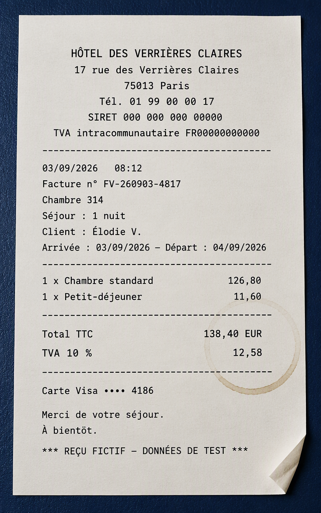
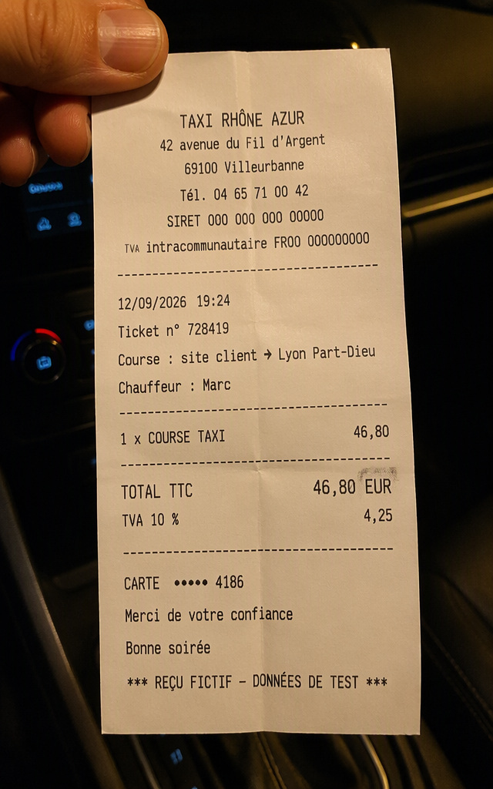
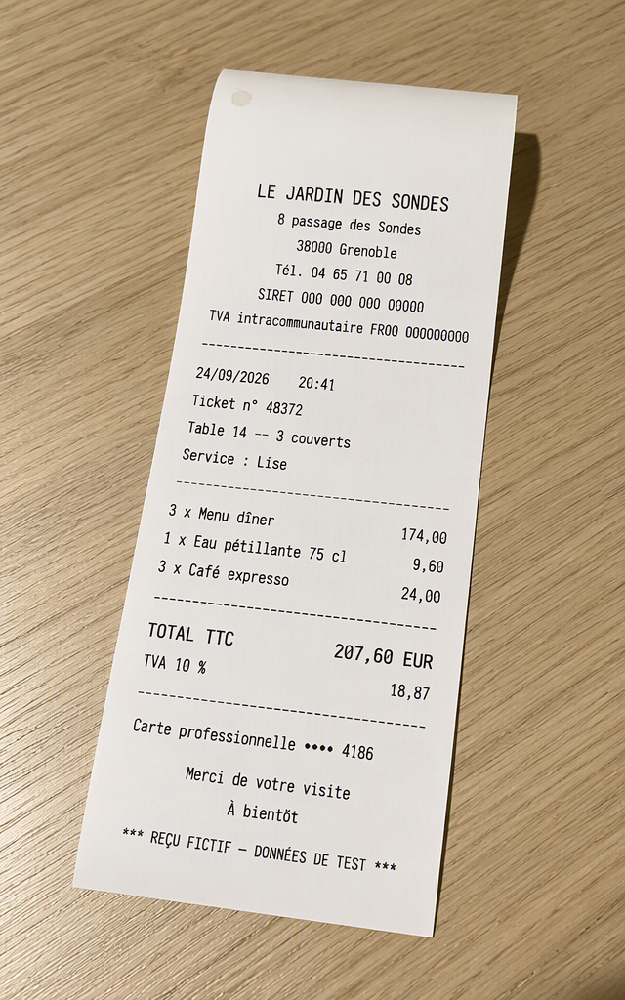
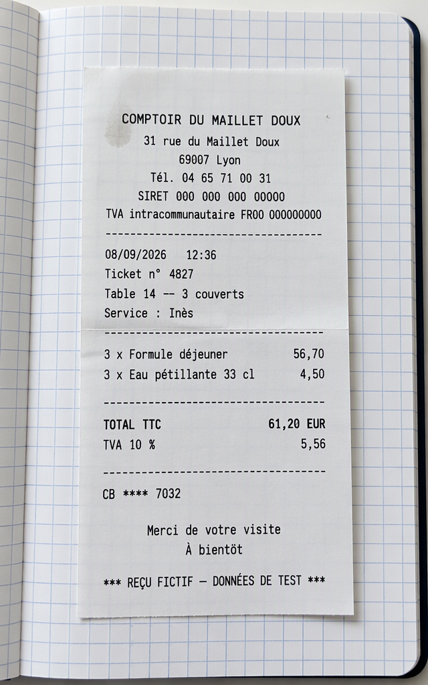
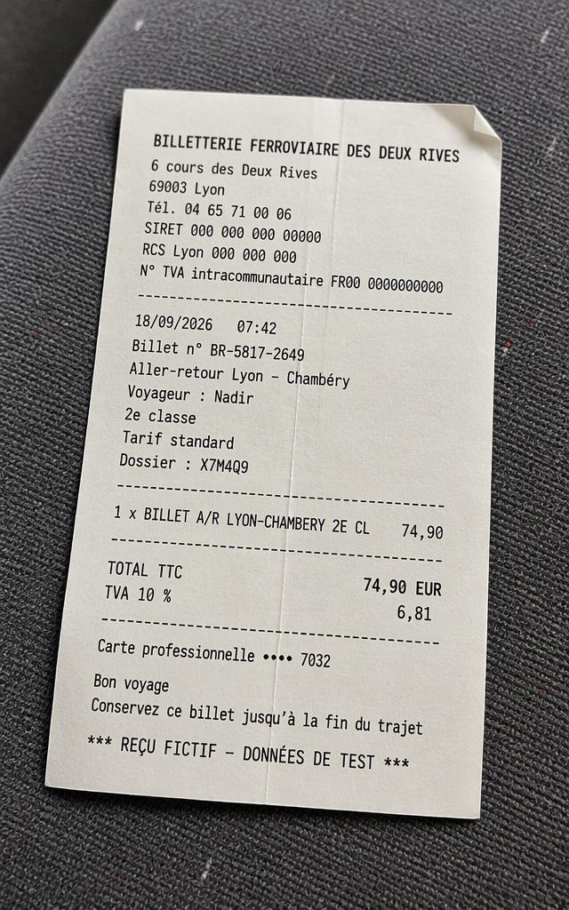
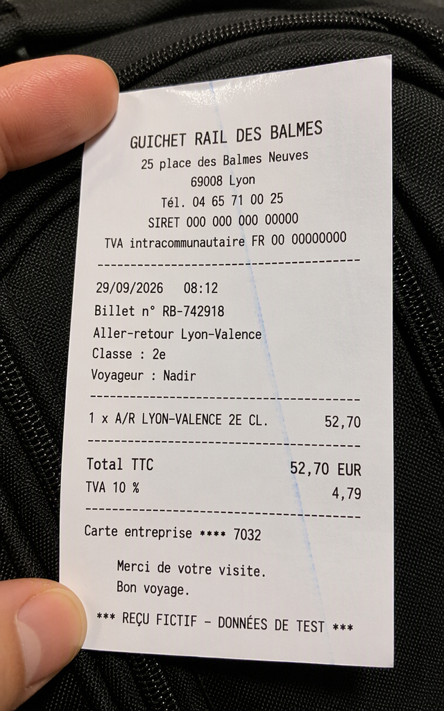

<!-- Generated by `make render` from methods/gen_expense_data/ and cookbook.toml. Edit those, or templates/, and render again; never edit this page by hand. -->

# Expense audit test batch with receipt photos

Read a brief giving a company's expense policy and the test batch it wants, and return expense reports for invented employees, each claim with a photo of its receipt and the verdict the audit should reach, compliant or the rule it breaks: here, an invented engineering consultancy in Lyon whose employees, merchants and receipts are all made up and whose receipt photos are generated by an image model, to test a change to an automated expense audit without a single real employee's claim.

`github.com/Pipelex/pipelex-cookbook/gen_expense_data@v0.19.1` · [bundle.mthds](bundle.mthds)

## The sample

> Test batch for our expense-audit workflow. Written for a Pipelex example: the company is not a real one, and every employee and merchant in the batch must be invented.
>
> We are an engineering consultancy of about 300 people based in Lyon, with clients across France. Claims are in euros and dated in September 2026, and receipts are French.
>
> Make the expense reports of two employees: a senior sales engineer who travels to clients, and a project engineer who mostly works from the office. Give each three claims.
>
> Our expense policy, as the audit applies it:
>
> 1. A working meal is reimbursed up to 25 euros a person, and a client meal up to 60 euros a person; a meal claim names the client or the project and how many people ate.
> 2. A hotel night is reimbursed up to 150 euros in Paris and 110 euros elsewhere, breakfast included.
> 3. Train travel is in second class.
> 4. Spending on a Saturday or a Sunday needs a manager's prior approval, which the claim mentions.
> 5. Alcohol on its own, personal purchases and entertainment are never reimbursed.
> 6. Every claim states its business purpose and names the client or the project.
>
> Make half of the claims compliant, and have each of the others break exactly one rule, a different rule each time, the way a real employee's claim would: a client dinner over the limit, a Saturday taxi with no approval mentioned, a purpose that says only "work".

*Written for this example.* Licence: [MIT](https://github.com/Pipelex/pipelex-cookbook/blob/main/LICENSE). Credit: Evotis S.A.S.

## What you get

Run on production on 27 September 2026, from the package's files, in 1 minute 10 seconds. This is what it returned:

### Report 1

**`employee`**

| Field | Value |
|---|---|
| `employee_id` | EMP-26041 |
| `full_name` | Élodie Vasseur |
| `email` | elodie.vasseur@example.com |
| `department` | Business Development |
| `job_title` | Senior Sales Engineer |

**`claims`**

| `claim_id` | `expense_date` | `merchant` | `category` | `amount` | `business_purpose` | `receipt` | `expected_verdict` |
|---|---|---|---|---|---|---|---|
| EXP-20260903-00583 | 2026-09-03 | Hôtel des Verrières Claires, Paris | Hotel | EUR 138.40 | Caldris Processus — Asterion Retrofit project | <a href="output/0-claims-0-receipt.png"></a> | Compliant |
| EXP-20260912-66851 | 2026-09-12 | Taxi Rhône Azur, Villeurbanne | Taxi | EUR 46.80 | Valcrête Systèmes Silex-4 commissioning review to Lyon Part-Dieu | <a href="output/0-claims-1-receipt.png"></a> | Breaks rule 4: Saturday taxi with no manager's prior approval mentioned |
| EXP-20260924-33105 | 2026-09-24 | Le Jardin des Sondes, Grenoble | Client Meals | EUR 207.60 | Ormevia Énergies — Hélianthe Controls proposal dinner, 3 attendees | <a href="output/0-claims-2-receipt.png"></a> | Breaks rule 1: client meal EUR 69.20 per person exceeds EUR 60 limit |

**`expense_report`**

<div>
<h4>Expense report</h4>
<p><strong>Élodie Vasseur</strong>, Senior Sales Engineer, Business Development<br>
Employee EMP-26041, elodie.vasseur@example.com</p>
<table>
<thead>
<tr><th>Claim</th><th>Date</th><th>Merchant</th><th>Category</th><th>Business purpose</th><th>Amount</th><th>Receipt</th></tr>
</thead>
<tbody>
<tr><td>EXP-20260903-00583</td><td>2026-09-03</td><td>Hôtel des Verrières Claires, Paris</td><td>Hotel</td><td>Caldris Processus — Asterion Retrofit project</td><td>EUR 138.40</td><td></td></tr>
<tr><td>EXP-20260912-66851</td><td>2026-09-12</td><td>Taxi Rhône Azur, Villeurbanne</td><td>Taxi</td><td>Valcrête Systèmes Silex-4 commissioning review to Lyon Part-Dieu</td><td>EUR 46.80</td><td></td></tr>
<tr><td>EXP-20260924-33105</td><td>2026-09-24</td><td>Le Jardin des Sondes, Grenoble</td><td>Client Meals</td><td>Ormevia Énergies — Hélianthe Controls proposal dinner, 3 attendees</td><td>EUR 207.60</td><td></td></tr>
<tr><td colspan="5"><strong>Total</strong></td><td><strong>EUR 392.80</strong></td><td></td></tr>
</tbody>
</table>
</div>

### Report 2

**`employee`**

| Field | Value |
|---|---|
| `employee_id` | EMP-26087 |
| `full_name` | Nadir Benali |
| `email` | nadir.benali@example.com |
| `department` | Engineering Delivery |
| `job_title` | Project Engineer |

**`claims`**

| `claim_id` | `expense_date` | `merchant` | `category` | `amount` | `business_purpose` | `receipt` | `expected_verdict` |
|---|---|---|---|---|---|---|---|
| EXP-20260908-49857 | 2026-09-08 | Comptoir du Maillet Doux, Lyon | Working Meals | EUR 61.20 | Quartz-Ligne design review lunch — 3 employees | <a href="output/1-claims-0-receipt.png"></a> | Compliant |
| EXP-20260918-60051 | 2026-09-18 | Billetterie Ferroviaire des Deux Rives, Lyon | Train | EUR 74.90 | Solo travel: Brumelac Industrie, Nacelle-7 sensor-layout workshop | <a href="output/1-claims-1-receipt.png"></a> | Compliant |
| EXP-20260929-20862 | 2026-09-29 | Guichet Rail des Balmes, Lyon | Train | EUR 52.70 | work | <a href="output/1-claims-2-receipt.png"></a> | Breaks rule 6: purpose says only "work" and names no client or project |

**`expense_report`**

<div>
<h4>Expense report</h4>
<p><strong>Nadir Benali</strong>, Project Engineer, Engineering Delivery<br>
Employee EMP-26087, nadir.benali@example.com</p>
<table>
<thead>
<tr><th>Claim</th><th>Date</th><th>Merchant</th><th>Category</th><th>Business purpose</th><th>Amount</th><th>Receipt</th></tr>
</thead>
<tbody>
<tr><td>EXP-20260908-49857</td><td>2026-09-08</td><td>Comptoir du Maillet Doux, Lyon</td><td>Working Meals</td><td>Quartz-Ligne design review lunch — 3 employees</td><td>EUR 61.20</td><td></td></tr>
<tr><td>EXP-20260918-60051</td><td>2026-09-18</td><td>Billetterie Ferroviaire des Deux Rives, Lyon</td><td>Train</td><td>Solo travel: Brumelac Industrie, Nacelle-7 sensor-layout workshop</td><td>EUR 74.90</td><td></td></tr>
<tr><td>EXP-20260929-20862</td><td>2026-09-29</td><td>Guichet Rail des Balmes, Lyon</td><td>Train</td><td>work</td><td>EUR 52.70</td><td></td></tr>
<tr><td colspan="5"><strong>Total</strong></td><td><strong>EUR 188.80</strong></td><td></td></tr>
</tbody>
</table>
</div>

**Takes** `brief`, a text (`ExpenseBrief`): A brief for a test batch of expense claims: the company, the employees and the claims wanted, the expense policy the audit applies, and the mix of compliant and rule-breaking claims.

**Returns** a list of `ExpenseReport`: One employee's expense report in the test batch: the employee, their claims with the verdict expected on each, and the
report as the employee submitted it.

- `employee`, an `Employee`: The employee.
- `claims`, a list of `ExpenseClaim`: The employee's claims, each with the photo of its receipt and the verdict the audit should reach.
- `expense_report`, a `HtmlContent`: The expense report as the employee submitted it, without the verdicts, which are the audit's to reach.

## Try it in your chatbot

With the Pipelex MCP in ChatGPT or Claude ([add it once](https://github.com/Pipelex/pipelex-mcp)), ask:

```text
Run github.com/Pipelex/pipelex-cookbook/gen_expense_data@v0.19.1 with the sample inputs in https://raw.githubusercontent.com/Pipelex/pipelex-cookbook/v0.19.1/methods/gen_expense_data/inputs.json
```

In Claude Code or Codex with the [Pipelex plugin](https://github.com/Pipelex/pipelex-plugins), the same sentence runs through `/pipelex-run`.

## Put it in your code

Each call runs the method on the hosted API with your `PIPELEX_API_KEY` ([create one](https://app.pipelex.com)).

<details>
<summary>TypeScript</summary>

```bash
npm install @pipelex/sdk
```

```ts
import { PipelexApiClient } from "@pipelex/sdk";

const client = new PipelexApiClient({ apiKey: process.env.PIPELEX_API_KEY });
const result = await client.startAndWaitForResult({
  method_ref: "github.com/Pipelex/pipelex-cookbook/gen_expense_data@v0.19.1",
  inputs: {
    brief: {
      text: "Test batch for our expense-audit workflow. Written for a Pipelex example: the company is not a real one, and every employee and merchant in the batch must be invented.\n\nWe are an engineering consultancy of about 300 people based in Lyon, with clients across France. Claims are in euros and dated in September 2026, and receipts are French.\n\nMake the expense reports of two employees: a senior sales engineer who travels to clients, and a project engineer who mostly works from the office. Give each three claims.\n\nOur expense policy, as the audit applies it:\n\n1. A working meal is reimbursed up to 25 euros a person, and a client meal up to 60 euros a person; a meal claim names the client or the project and how many people ate.\n2. A hotel night is reimbursed up to 150 euros in Paris and 110 euros elsewhere, breakfast included.\n3. Train travel is in second class.\n4. Spending on a Saturday or a Sunday needs a manager's prior approval, which the claim mentions.\n5. Alcohol on its own, personal purchases and entertainment are never reimbursed.\n6. Every claim states its business purpose and names the client or the project.\n\nMake half of the claims compliant, and have each of the others break exactly one rule, a different rule each time, the way a real employee's claim would: a client dinner over the limit, a Saturday taxi with no approval mentioned, a purpose that says only \"work\".\n",
    },
  },
});
console.log(result.main_stuff);
```

</details>

<details>
<summary>Python</summary>

```bash
pip install pipelex-sdk
```

```python
import asyncio

from pipelex_sdk.client import PipelexAPIClient


async def main() -> None:
    async with PipelexAPIClient() as client:
        result = await client.start_and_wait(
            method_ref="github.com/Pipelex/pipelex-cookbook/gen_expense_data@v0.19.1",
            inputs={
                "brief": {
                    "text": "Test batch for our expense-audit workflow. Written for a Pipelex example: the company is not a real one, and every employee and merchant in the batch must be invented.\n\nWe are an engineering consultancy of about 300 people based in Lyon, with clients across France. Claims are in euros and dated in September 2026, and receipts are French.\n\nMake the expense reports of two employees: a senior sales engineer who travels to clients, and a project engineer who mostly works from the office. Give each three claims.\n\nOur expense policy, as the audit applies it:\n\n1. A working meal is reimbursed up to 25 euros a person, and a client meal up to 60 euros a person; a meal claim names the client or the project and how many people ate.\n2. A hotel night is reimbursed up to 150 euros in Paris and 110 euros elsewhere, breakfast included.\n3. Train travel is in second class.\n4. Spending on a Saturday or a Sunday needs a manager's prior approval, which the claim mentions.\n5. Alcohol on its own, personal purchases and entertainment are never reimbursed.\n6. Every claim states its business purpose and names the client or the project.\n\nMake half of the claims compliant, and have each of the others break exactly one rule, a different rule each time, the way a real employee's claim would: a client dinner over the limit, a Saturday taxi with no approval mentioned, a purpose that says only \"work\".\n",
                },
            },
        )
        print(result.main_stuff)


asyncio.run(main())
```

</details>

<details>
<summary>Any HTTP client</summary>

The start call answers at once with the run's id, or with the reason it refused the run; the results call answers 202 while the run is going, 200 with the results once it has completed, and 409 if it failed. The snippet uses `jq` to read the id.

```bash
START=$(curl -s https://api.pipelex.com/v1/start \
  -H "Authorization: Bearer $PIPELEX_API_KEY" -H "Content-Type: application/json" \
  -d '{"method_ref": "github.com/Pipelex/pipelex-cookbook/gen_expense_data@v0.19.1", "inputs": {"brief": {"text": "Test batch for our expense-audit workflow. Written for a Pipelex example: the company is not a real one, and every employee and merchant in the batch must be invented.\n\nWe are an engineering consultancy of about 300 people based in Lyon, with clients across France. Claims are in euros and dated in September 2026, and receipts are French.\n\nMake the expense reports of two employees: a senior sales engineer who travels to clients, and a project engineer who mostly works from the office. Give each three claims.\n\nOur expense policy, as the audit applies it:\n\n1. A working meal is reimbursed up to 25 euros a person, and a client meal up to 60 euros a person; a meal claim names the client or the project and how many people ate.\n2. A hotel night is reimbursed up to 150 euros in Paris and 110 euros elsewhere, breakfast included.\n3. Train travel is in second class.\n4. Spending on a Saturday or a Sunday needs a manager'\''s prior approval, which the claim mentions.\n5. Alcohol on its own, personal purchases and entertainment are never reimbursed.\n6. Every claim states its business purpose and names the client or the project.\n\nMake half of the claims compliant, and have each of the others break exactly one rule, a different rule each time, the way a real employee'\''s claim would: a client dinner over the limit, a Saturday taxi with no approval mentioned, a purpose that says only \"work\".\n"}}}')
RUN_ID=$(printf '%s' "$START" | jq -r '.pipeline_run_id // empty')
if [ -z "$RUN_ID" ]; then printf '%s\n' "$START"; else
  until [ "$(curl -s -o results.json -w '%{http_code}' https://api.pipelex.com/v1/runs/$RUN_ID/results \
    -H "Authorization: Bearer $PIPELEX_API_KEY")" != 202 ]; do sleep 5; done
  cat results.json
fi
```

</details>

In a project you already have, ask your agent for `/pipelex-integrate github.com/Pipelex/pipelex-cookbook/gen_expense_data@v0.19.1`: it generates the result's types and writes one typed call.

## Make it an app

```bash
npm create @pipelex/method-app@latest expense-audit-test-app -- --method github.com/Pipelex/pipelex-cookbook/gen_expense_data@v0.19.1
make -C expense-audit-test-app serve
```

The form and the result view come from the method's contract. `make serve` prints the app's URL once the page answers, and `make stop` stops it. Your agent does the same with `/pipelex-scaffold`.

## Make it yours

Ask your agent:

```text
Copy github.com/Pipelex/pipelex-cookbook/gen_expense_data@v0.19.1 into ./expense-test-data, also return one CSV of every claim, with its receipt's file name and its expected verdict, in the columns the expense tool's import takes, prove it on the sample, and save it to my Pipelex account.
```

From then on every door above takes your method's id (`mt_…`) in place of the address, and your chatbot lists it among your methods.

## Run it on your own machine

With the Pipelex runtime and your own provider keys ([set it up](https://docs.pipelex.com/latest/get-started/run-it-yourself/)):

```bash
curl -sLo inputs.json https://raw.githubusercontent.com/Pipelex/pipelex-cookbook/v0.19.1/methods/gen_expense_data/inputs.json
pipelex run method github.com/Pipelex/pipelex-cookbook/gen_expense_data@v0.19.1 --inputs inputs.json
```
