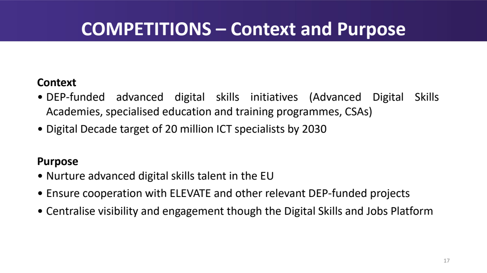

<!-- Generated by `make render` from methods/qualify_bid/ and cookbook.toml. Edit those, or templates/, and render again; never edit this page by hand. -->

# Go/no-go sheet from a funder's briefing deck

Read a funder's or buyer's briefing deck against the company's bid criteria, and return the go/no-go sheet a bid manager takes to the bid/no-bid meeting and files in the bid pipeline: each criterion met, missed or not stated, with what the deck says and the slides it rests on, a recommendation by the company's own rule, and the questions to send to the funder, a partner or management before bidding.

`github.com/Pipelex/pipelex-cookbook/qualify_bid@v0.20.2` · [bundle.mthds](bundle.mthds) · [sample briefing deck](https://raw.githubusercontent.com/Pipelex/pipelex-cookbook/main/assets/qualify_bid/advanced_digital_skills_info_day.pdf)

## The sample

**Sample briefing deck**

<a href="../../assets/qualify_bid/advanced_digital_skills_info_day.pdf"></a>

*From [https://digital-skills-jobs.europa.eu/system/files/2025-12/DIGITAL%20InfoDay%20_MASTER_SLIDE_9THCALL_DECEMBER_2025.pdf](https://digital-skills-jobs.europa.eu/system/files/2025-12/DIGITAL%20InfoDay%20_MASTER_SLIDE_9THCALL_DECEMBER_2025.pdf), copied on 2026-09-26. Cut to 12 of its 83 slides: the original slides 17 to 20, 55, 56, 73, 74 and 80 to 83, in that order; the logos painted out of every slide, since the Commission's reuse policy excludes logos from the licence.* Licence: [CC-BY-4.0](https://creativecommons.org/licenses/by/4.0/). Credit: Digital Europe Programme, Call 9: Advanced Digital Skills, Info Day for potential applicants, 1 December 2025. © European Union, reused under CC BY 4.0.

**Sample bid criteria**

> Bid criteria: written for a Pipelex example, not any real company's policy.
>
> Who we are. We are a training company established in an EU Member State, with about sixty staff. We design and run technical courses, hackathons and challenge-based competitions in artificial intelligence, data science and virtual worlds, for universities, engineering schools and employers, online and on site, and we run the communication campaigns that bring their participants in. We work with a standing network of universities and training providers in other Member States.
>
> When a funder or a buyer briefs bidders, we bid only when every criterion below is met. Each criterion is met, missed, or not stated when the briefing does not say enough to decide it.
>
> 1. Eligibility. Met when a company established in an EU Member State may take part, as coordinator or as partner, and the briefing states the consortium the funder requires, which we can form with our network. Missed when companies, or companies from our country, cannot take part. Not stated when the briefing does not say who may apply or what the consortium must be.
>
> 2. Deadline. Met when the submission deadline falls at least twelve weeks after the date of the briefing, the time we need to form a consortium and write the proposal. Missed when it falls sooner.
>
> 3. Budget. Met when the EU contribution available for the topic is at least EUR 2 million and the funding rate is at least 70% of eligible costs. Missed when either is lower. The briefing should also say how many projects the topic will fund, since one budget shared among several projects may leave each too small: when it does not, the criterion is decided on the topic's budget, and the number of projects becomes a question.
>
> 4. Required capabilities. Met when our own staff can carry the core of the work the topic asks for: designing challenges and their rule books, running competitions and events online and on site, running the jury, and the communication campaigns that reach participants, in the fields we cover, which are artificial intelligence, data science and virtual worlds. A field the topic asks for that we do not cover can be taken on by a partner, but the criterion stays missed until that partner is named.
>
> 5. Evaluation. Met when the briefing gives the award criteria with their weights or maximum scores and their pass thresholds, and implementation (how the work is organised, with what resources and by whom) counts for at least as much as each other criterion. Missed when implementation counts for less than another criterion. Not stated when the briefing gives no award criteria.
>
> The recommendation
>
> - Go: every criterion is met.
> - Go if answered: no criterion is missed but some are not stated, or the only criteria missed are ones this list says can be put right before the deadline, such as a field a partner can take on. The questions say what must be settled first.
> - No-go: any other criterion is missed.
>
> The questions
>
> One question for each criterion not stated, and one for each gap to close before the deadline, each saying whom to ask: the funder, through the question service the briefing names; a partner; or our own management.

*Written for this example.* Licence: [MIT](https://github.com/Pipelex/pipelex-cookbook/blob/main/LICENSE). Credit: Evotis S.A.S.

**Date of the info day**

| Field | Value |
|---|---|
| `date` | 2025-12-01 |

*From [https://digital-skills-jobs.europa.eu/system/files/2025-12/DIGITAL%20InfoDay%20_MASTER_SLIDE_9THCALL_DECEMBER_2025.pdf](https://digital-skills-jobs.europa.eu/system/files/2025-12/DIGITAL%20InfoDay%20_MASTER_SLIDE_9THCALL_DECEMBER_2025.pdf), copied on 2026-09-26. The date the deck's cover prints, given as a date of its own since the sample leaves the cover out.* Licence: [CC-BY-4.0](https://creativecommons.org/licenses/by/4.0/). Credit: Digital Europe Programme, Call 9: Advanced Digital Skills, Info Day for potential applicants, 1 December 2025. © European Union, reused under CC BY 4.0.

## What you get

Run on production on 27 September 2026, from the package's files, in 55 seconds. This is what it returned:

| Field | Value |
|---|---|
| `opportunity` | Digital Call 9 — DIGITAL-2026-SKILLS-09-COMPETITIONS — European Advanced Digital Skills Competitions |
| `briefing_date` | 2025-12-01 |
| `recommendation` | Go if answered |

**`summary`**

The deadline, budget and evaluation criteria are met; eligibility is not stated, and the required capabilities criterion is missed because no partner is named for quantum, semiconductors and Destination Earth. Before committing, confirm company eligibility and the required applicant consortium, establish how many projects the topic will fund, and name partner(s) to cover those three fields before the deadline.

**`criteria`**

| `criterion` | `verdict` | `what_the_deck_says` | `slides` | `note` |
|---|---|---|---|---|
| Eligibility | not stated | The deck gives a “Recommended consortium composition” that includes “industry partners.” It says “Consortium composition compliance is a must” but tells applicants to read Section 6 of the call document and the Targeted Stakeholders section for the topic. | 4, 9 | The briefing neither confirms that an EU-established company may apply as coordinator or partner nor states the mandatory applicant consortium. |
| Deadline | met | Deadline for submission: 03 March 2026 @17:00 CET (Brussels). | 6 | The deadline is 13 weeks and 1 day after the 1 December 2025 briefing date, exceeding the required twelve weeks. |
| Budget | met | For DIGITAL-2026-SKILLS-09-COMPETITIONS — European Advanced Digital Skills Competitions, the table gives a 100% funding rate and an available budget of EUR 7 000 000. It does not state how many projects the topic will fund. | 5 | The topic has EUR 7,000,000 available at a 100% funding rate, both above the required thresholds, while the unstated project count becomes a question. |
| Required capabilities | missed | Six competitions: AI, Virtual Worlds, quantum, semiconductors, Destination Earth initiative, an additional area chosen by the consortium. Deliverables include relevant challenges, a competition rule book for participants and jury, and implementation and roll-out of the six competitions; evaluators will also look at people reached through communication campaigns and events organised online and physical. | 2, 3, 4 | Quantum, semiconductors and Destination Earth fall outside our stated fields, and no partner is named to take them on. |
| Evaluation | met | Relevance, Implementation and Impact each have a maximum score of 5 and a minimum pass score of 3; a proposal must also obtain an overall score of at least 10. | 7, 8 | Implementation has the same maximum score of 5 as Relevance and Impact, and the deck gives both the per-criterion threshold of 3 and overall threshold of 10. |

**`questions`**

| `question` | `criterion` | `ask` |
|---|---|---|
| May a company established in an EU Member State apply as coordinator or partner, and what applicant consortium is required for DIGITAL-2026-SKILLS-09-COMPETITIONS? | Eligibility | The funder, through the F&T Portal “Write to us” form |
| How many projects will DIGITAL-2026-SKILLS-09-COMPETITIONS fund? | Budget | The funder, through the F&T Portal “Write to us” form |
| Will you join the consortium and cover quantum, semiconductors and Destination Earth? | Required capabilities | A partner |

**Takes**

- `briefing`, a document (`BriefingDeck`): A funder's or buyer's briefing deck for a call for funding or a tender, as a PDF.
- `criteria`, a text (`BidCriteria`): The company's bid criteria: who it is, each criterion and what meets it, and its rules for the recommendation and the questions.
- `briefing_date`, a date (`Date`), optional.

**Returns** a `BidSheet`: A go/no-go sheet for a briefing: the opportunity, a recommendation by the company's rule, a row per criterion, and the questions.

- `opportunity`, text: The call or topic assessed, as the deck names it.
- `briefing_date`, a date: The date of the briefing.
- `recommendation`, text: Whether to bid, by the company's rule.
- `summary`, text: The criteria met, the gap that decides the bid, and what must be settled before committing.
- `criteria`, a list of `CriterionRow`: One row per bid criterion, in the criteria's order.
- `questions`, a list of `BidQuestion`: The questions to settle before bidding, each with whom to ask.

## Try it in your chatbot

With the Pipelex MCP in ChatGPT or Claude ([add it once](https://github.com/Pipelex/pipelex-mcp)), ask:

```text
Run github.com/Pipelex/pipelex-cookbook/qualify_bid@v0.20.2 on https://raw.githubusercontent.com/Pipelex/pipelex-cookbook/main/assets/qualify_bid/advanced_digital_skills_info_day.pdf, with the other sample inputs in https://raw.githubusercontent.com/Pipelex/pipelex-cookbook/v0.20.2/methods/qualify_bid/inputs.json
```

In ChatGPT you can attach your own file instead of the link; Claude takes a link. In Claude Code or Codex with the [Pipelex plugin](https://github.com/Pipelex/pipelex-plugins), the same sentence runs through `/pipelex-run`.

## Put it in your code

Each call runs the method on the hosted API with your `PIPELEX_API_KEY` ([create one](https://app.pipelex.com)).

<details>
<summary>TypeScript</summary>

```bash
npm install @pipelex/sdk
```

```ts
import { PipelexApiClient } from "@pipelex/sdk";

const client = new PipelexApiClient({ apiKey: process.env.PIPELEX_API_KEY });
const result = await client.startAndWaitForResult({
  method_ref: "github.com/Pipelex/pipelex-cookbook/qualify_bid@v0.20.2",
  inputs: {
    briefing: {
      url: "https://raw.githubusercontent.com/Pipelex/pipelex-cookbook/main/assets/qualify_bid/advanced_digital_skills_info_day.pdf",
    },
    criteria: {
      text: "Bid criteria: written for a Pipelex example, not any real company's policy.\n\nWho we are. We are a training company established in an EU Member State, with about sixty staff. We design and run technical courses, hackathons and challenge-based competitions in artificial intelligence, data science and virtual worlds, for universities, engineering schools and employers, online and on site, and we run the communication campaigns that bring their participants in. We work with a standing network of universities and training providers in other Member States.\n\nWhen a funder or a buyer briefs bidders, we bid only when every criterion below is met. Each criterion is met, missed, or not stated when the briefing does not say enough to decide it.\n\n1. Eligibility. Met when a company established in an EU Member State may take part, as coordinator or as partner, and the briefing states the consortium the funder requires, which we can form with our network. Missed when companies, or companies from our country, cannot take part. Not stated when the briefing does not say who may apply or what the consortium must be.\n\n2. Deadline. Met when the submission deadline falls at least twelve weeks after the date of the briefing, the time we need to form a consortium and write the proposal. Missed when it falls sooner.\n\n3. Budget. Met when the EU contribution available for the topic is at least EUR 2 million and the funding rate is at least 70% of eligible costs. Missed when either is lower. The briefing should also say how many projects the topic will fund, since one budget shared among several projects may leave each too small: when it does not, the criterion is decided on the topic's budget, and the number of projects becomes a question.\n\n4. Required capabilities. Met when our own staff can carry the core of the work the topic asks for: designing challenges and their rule books, running competitions and events online and on site, running the jury, and the communication campaigns that reach participants, in the fields we cover, which are artificial intelligence, data science and virtual worlds. A field the topic asks for that we do not cover can be taken on by a partner, but the criterion stays missed until that partner is named.\n\n5. Evaluation. Met when the briefing gives the award criteria with their weights or maximum scores and their pass thresholds, and implementation (how the work is organised, with what resources and by whom) counts for at least as much as each other criterion. Missed when implementation counts for less than another criterion. Not stated when the briefing gives no award criteria.\n\nThe recommendation\n\n- Go: every criterion is met.\n- Go if answered: no criterion is missed but some are not stated, or the only criteria missed are ones this list says can be put right before the deadline, such as a field a partner can take on. The questions say what must be settled first.\n- No-go: any other criterion is missed.\n\nThe questions\n\nOne question for each criterion not stated, and one for each gap to close before the deadline, each saying whom to ask: the funder, through the question service the briefing names; a partner; or our own management.",
    },
    briefing_date: {
      date: "2025-12-01",
    },
  },
});
console.log(result.main_stuff);
```

</details>

<details>
<summary>Python</summary>

```bash
pip install pipelex-sdk
```

```python
import asyncio

from pipelex_sdk.client import PipelexAPIClient


async def main() -> None:
    async with PipelexAPIClient() as client:
        result = await client.start_and_wait(
            method_ref="github.com/Pipelex/pipelex-cookbook/qualify_bid@v0.20.2",
            inputs={
                "briefing": {
                    "url": "https://raw.githubusercontent.com/Pipelex/pipelex-cookbook/main/assets/qualify_bid/advanced_digital_skills_info_day.pdf",
                },
                "criteria": {
                    "text": "Bid criteria: written for a Pipelex example, not any real company's policy.\n\nWho we are. We are a training company established in an EU Member State, with about sixty staff. We design and run technical courses, hackathons and challenge-based competitions in artificial intelligence, data science and virtual worlds, for universities, engineering schools and employers, online and on site, and we run the communication campaigns that bring their participants in. We work with a standing network of universities and training providers in other Member States.\n\nWhen a funder or a buyer briefs bidders, we bid only when every criterion below is met. Each criterion is met, missed, or not stated when the briefing does not say enough to decide it.\n\n1. Eligibility. Met when a company established in an EU Member State may take part, as coordinator or as partner, and the briefing states the consortium the funder requires, which we can form with our network. Missed when companies, or companies from our country, cannot take part. Not stated when the briefing does not say who may apply or what the consortium must be.\n\n2. Deadline. Met when the submission deadline falls at least twelve weeks after the date of the briefing, the time we need to form a consortium and write the proposal. Missed when it falls sooner.\n\n3. Budget. Met when the EU contribution available for the topic is at least EUR 2 million and the funding rate is at least 70% of eligible costs. Missed when either is lower. The briefing should also say how many projects the topic will fund, since one budget shared among several projects may leave each too small: when it does not, the criterion is decided on the topic's budget, and the number of projects becomes a question.\n\n4. Required capabilities. Met when our own staff can carry the core of the work the topic asks for: designing challenges and their rule books, running competitions and events online and on site, running the jury, and the communication campaigns that reach participants, in the fields we cover, which are artificial intelligence, data science and virtual worlds. A field the topic asks for that we do not cover can be taken on by a partner, but the criterion stays missed until that partner is named.\n\n5. Evaluation. Met when the briefing gives the award criteria with their weights or maximum scores and their pass thresholds, and implementation (how the work is organised, with what resources and by whom) counts for at least as much as each other criterion. Missed when implementation counts for less than another criterion. Not stated when the briefing gives no award criteria.\n\nThe recommendation\n\n- Go: every criterion is met.\n- Go if answered: no criterion is missed but some are not stated, or the only criteria missed are ones this list says can be put right before the deadline, such as a field a partner can take on. The questions say what must be settled first.\n- No-go: any other criterion is missed.\n\nThe questions\n\nOne question for each criterion not stated, and one for each gap to close before the deadline, each saying whom to ask: the funder, through the question service the briefing names; a partner; or our own management.",
                },
                "briefing_date": {
                    "date": "2025-12-01",
                },
            },
        )
        print(result.main_stuff)


asyncio.run(main())
```

</details>

<details>
<summary>Any HTTP client</summary>

The start call answers at once with the run's id, or with the reason it refused the run; the results call answers 202 while the run is going, 200 with the results once it has completed, and 409 if it failed. The snippet uses `jq` to read the id.

```bash
START=$(curl -s https://api.pipelex.com/v1/start \
  -H "Authorization: Bearer $PIPELEX_API_KEY" -H "Content-Type: application/json" \
  -d '{"method_ref": "github.com/Pipelex/pipelex-cookbook/qualify_bid@v0.20.2", "inputs": {"briefing": {"url": "https://raw.githubusercontent.com/Pipelex/pipelex-cookbook/main/assets/qualify_bid/advanced_digital_skills_info_day.pdf"}, "criteria": {"text": "Bid criteria: written for a Pipelex example, not any real company'\''s policy.\n\nWho we are. We are a training company established in an EU Member State, with about sixty staff. We design and run technical courses, hackathons and challenge-based competitions in artificial intelligence, data science and virtual worlds, for universities, engineering schools and employers, online and on site, and we run the communication campaigns that bring their participants in. We work with a standing network of universities and training providers in other Member States.\n\nWhen a funder or a buyer briefs bidders, we bid only when every criterion below is met. Each criterion is met, missed, or not stated when the briefing does not say enough to decide it.\n\n1. Eligibility. Met when a company established in an EU Member State may take part, as coordinator or as partner, and the briefing states the consortium the funder requires, which we can form with our network. Missed when companies, or companies from our country, cannot take part. Not stated when the briefing does not say who may apply or what the consortium must be.\n\n2. Deadline. Met when the submission deadline falls at least twelve weeks after the date of the briefing, the time we need to form a consortium and write the proposal. Missed when it falls sooner.\n\n3. Budget. Met when the EU contribution available for the topic is at least EUR 2 million and the funding rate is at least 70% of eligible costs. Missed when either is lower. The briefing should also say how many projects the topic will fund, since one budget shared among several projects may leave each too small: when it does not, the criterion is decided on the topic'\''s budget, and the number of projects becomes a question.\n\n4. Required capabilities. Met when our own staff can carry the core of the work the topic asks for: designing challenges and their rule books, running competitions and events online and on site, running the jury, and the communication campaigns that reach participants, in the fields we cover, which are artificial intelligence, data science and virtual worlds. A field the topic asks for that we do not cover can be taken on by a partner, but the criterion stays missed until that partner is named.\n\n5. Evaluation. Met when the briefing gives the award criteria with their weights or maximum scores and their pass thresholds, and implementation (how the work is organised, with what resources and by whom) counts for at least as much as each other criterion. Missed when implementation counts for less than another criterion. Not stated when the briefing gives no award criteria.\n\nThe recommendation\n\n- Go: every criterion is met.\n- Go if answered: no criterion is missed but some are not stated, or the only criteria missed are ones this list says can be put right before the deadline, such as a field a partner can take on. The questions say what must be settled first.\n- No-go: any other criterion is missed.\n\nThe questions\n\nOne question for each criterion not stated, and one for each gap to close before the deadline, each saying whom to ask: the funder, through the question service the briefing names; a partner; or our own management."}, "briefing_date": {"date": "2025-12-01"}}}')
RUN_ID=$(printf '%s' "$START" | jq -r '.pipeline_run_id // empty')
if [ -z "$RUN_ID" ]; then printf '%s\n' "$START"; else
  until [ "$(curl -s -o results.json -w '%{http_code}' https://api.pipelex.com/v1/runs/$RUN_ID/results \
    -H "Authorization: Bearer $PIPELEX_API_KEY")" != 202 ]; do sleep 5; done
  cat results.json
fi
```

</details>

In a project you already have, ask your agent for `/pipelex-integrate github.com/Pipelex/pipelex-cookbook/qualify_bid@v0.20.2`: it generates the result's types and writes one typed call.

## Make it an app

```bash
npm create @pipelex/method-app@latest bid-sheet-app -- --method github.com/Pipelex/pipelex-cookbook/qualify_bid@v0.20.2
make -C bid-sheet-app serve
```

The form and the result view come from the method's contract. `make serve` prints the app's URL once the page answers, and `make stop` stops it. Your agent does the same with `/pipelex-scaffold`.

## Make it yours

Ask your agent:

```text
Copy github.com/Pipelex/pipelex-cookbook/qualify_bid@v0.20.2 into ./bid-sheet, add the submission deadline as a date, and the topic's budget and funding rate, as fields of their own that the bid pipeline files with the sheet, prove it on the sample, and save it to my Pipelex account.
```

From then on every door above takes your method's id (`mt_…`) in place of the address, and your chatbot lists it among your methods.

## Run it on your own machine

With the Pipelex runtime and your own provider keys ([set it up](https://docs.pipelex.com/latest/get-started/run-it-yourself/)):

```bash
curl -sLo inputs.json https://raw.githubusercontent.com/Pipelex/pipelex-cookbook/v0.20.2/methods/qualify_bid/inputs.json
pipelex run method github.com/Pipelex/pipelex-cookbook/qualify_bid@v0.20.2 --inputs inputs.json
```
