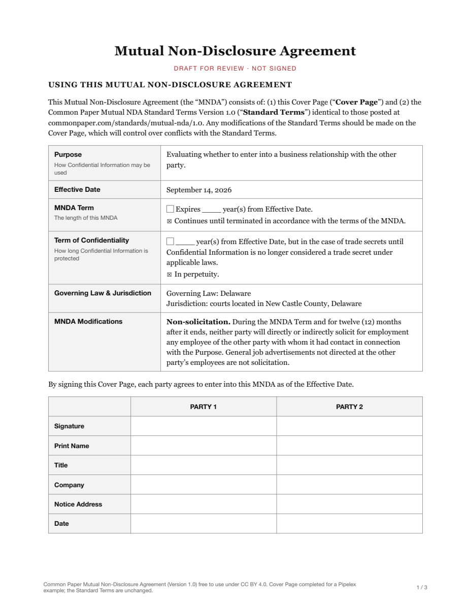

<!-- Generated by `make render` from methods/review_nda/ and cookbook.toml. Edit those, or templates/, and render again; never edit this page by hand. -->

# NDA review against a playbook

Read a counterparty's NDA and the company's NDA playbook, and return a first-pass review with one row per playbook position, giving the clause that deals with it, whether it is acceptable, to negotiate or to refuse, and the playbook's fallback wording, then a verdict and a short note for the lawyer who signs off.

`github.com/Pipelex/pipelex-cookbook/review_nda@v0.19.1` · [bundle.mthds](bundle.mthds) · [sample NDA](https://raw.githubusercontent.com/Pipelex/pipelex-cookbook/main/assets/review_nda/mutual_nda.pdf)

## The sample

**Sample NDA**

<a href="../../assets/review_nda/mutual_nda.pdf"></a>

*From [https://github.com/CommonPaper/Mutual-NDA/tree/2a3068b6c0ab6015c440f541d5b215bc3ac2f4cb](https://github.com/CommonPaper/Mutual-NDA/tree/2a3068b6c0ab6015c440f541d5b215bc3ac2f4cb), copied on 2026-09-26. Laid out as a three-page PDF, with the Cover Page completed for this example as a counterparty's draft and left unsigned; the Standard Terms are unchanged.* Licence: [CC-BY-4.0](https://creativecommons.org/licenses/by/4.0/). Credit: Common Paper Mutual Non-Disclosure Agreement (Version 1.0) free to use under CC BY 4.0.

**Sample playbook**

> NDA playbook: written for a Pipelex example, not any real company's policy.
>
> We sign a mutual NDA on the counterparty's paper when every position below is met. Each position says what we accept, what we negotiate and what we refuse, and gives the wording we offer instead.
>
> 1. Mutuality. Accept: the obligations bind both parties alike. Negotiate: a one-way NDA that protects only the counterparty when we will disclose too. Offer: "Each party may disclose Confidential Information to the other, and the obligations of this Agreement apply to each party as Receiving Party."
>
> 2. Purpose. Accept: use limited to evaluating or pursuing a business relationship between the parties. Negotiate: an open-ended purpose, or one letting the recipient use the information for its own products. Offer: "Evaluating whether to enter into a business relationship with the other party."
>
> 3. Definition of Confidential Information. Accept: information marked or identified as confidential, or that a reasonable person would understand to be confidential from its nature and the circumstances of its disclosure. Negotiate: everything disclosed, marked or not, with no test of reasonableness.
>
> 4. Standard exclusions. Accept only when all four are there: information that is public through no fault of the recipient, already known to it, received from a third party without restriction, or independently developed. Refuse: any of the four missing. Offer: the missing exclusion, in those words.
>
> 5. Sharing with representatives. Accept: sharing with its employees, officers, agents, advisers, contractors and other representatives who need to know for the purpose and are bound by confidentiality at least as protective, the party remaining responsible for them. Negotiate: a prior written consent for each person, or sharing with affiliates or anyone else without a need to know.
>
> 6. Disclosures required by law. Accept: disclosure the law, a regulator or a court requires, with prompt notice where the law allows it, and reasonable help, at the other party's expense, if it seeks to protect the information.
>
> 7. Agreement term. Accept: up to two years, or until either party ends it on notice. Negotiate: more than two years with no right to end it.
>
> 8. Confidentiality period. Accept: up to five years from disclosure, and trade secrets for as long as they remain trade secrets. Negotiate: more than five years, or confidentiality in perpetuity for all information. Offer: "Five years from the Effective Date, but in the case of trade secrets until the information is no longer a trade secret under applicable law."
>
> 9. Return or destruction. Accept: return or destruction on request, with written confirmation if asked, keeping copies in routine backups and where the law requires, still under confidentiality. Negotiate: a duty to purge backups.
>
> 10. Remedies. Accept: the right to seek an injunction or other equitable relief. Refuse: liquidated damages, penalties or an indemnity for breach. Offer: delete the clause.
>
> 11. Governing law and courts. Accept: the law of New York or of Delaware, with the courts of the same state. Negotiate: any other law or forum. Offer: "The laws of the State of New York, with the courts located in New York County, New York."
>
> 12. Non-solicitation, non-competition and exclusivity. Refuse in an NDA, whatever their length: they belong in the commercial agreement, if anywhere. Offer: delete the clause.
>
> 13. Assignment. Accept: no assignment without the other party's consent, except to a successor in a merger, reorganization or acquisition, or in a sale of all or substantially all of the business, its assets or its shares. Negotiate: a right to assign freely, or to any affiliate without consent.
>
> 14. No licence, no warranty, no obligation to proceed. Accept: disclosure grants no licence and no warranty, the information being given as is, and neither party must disclose anything or go ahead with a transaction.
>
> Anything the draft adds that no position above covers goes to counsel.

*Written for this example.* Licence: [MIT](https://github.com/Pipelex/pipelex-cookbook/blob/main/LICENSE). Credit: Evotis S.A.S.

## What you get

Run on production on 26 September 2026, from the package's files, in 30 seconds. This is what it returned:

| Field | Value |
|---|---|
| `verdict` | Escalate to counsel |

**`note_for_counsel`**

This is a mutual Common Paper NDA governed by Delaware law. It cannot be signed because the Cover Page adds a non-solicitation obligation, which the playbook requires deleting from an NDA; it also selects perpetual confidentiality for all information, which must be changed to the playbook’s five-year period with trade-secret treatment.

**`positions`**

| `position` | `clause` | `the_draft_says` | `assessment` | `fallback` |
|---|---|---|---|---|
| Mutuality | Standard Terms §§1–2 | The agreement states that "each party" may be a "Disclosing Party" and a "Receiving Party," and imposes the use, nondisclosure, and protection obligations on the "Receiving Party." | acceptable |   |
| Purpose | Cover Page, Purpose; Standard Terms §2(a) | The Cover Page states that Confidential Information may be used for "Evaluating whether to enter into a business relationship with the other party." Standard Terms §2(a) requires use "solely for the Purpose." | acceptable |   |
| Definition of Confidential Information | Standard Terms §1, Introduction | Confidential Information is information the Disclosing Party identifies as “confidential”, “proprietary”, or the like, or that “should be reasonably understood as confidential or proprietary due to its nature and the circumstances of its disclosure.” | acceptable |   |
| Standard exclusions | Standard Terms §3 (Exceptions) | The Receiving Party's obligations do not apply to information it can demonstrate "is or becomes publicly available through no fault," was rightfully known before receipt, was obtained from a third party "without confidentiality restrictions," or was independently developed without using or referencing the Confidential Information. | acceptable |   |
| Sharing with representatives | Standard Terms §2(b) | The Receiving Party may disclose Confidential Information to its "employees, agents, advisors, contractors and other representatives having a reasonable need to know for the Purpose," if they are bound by confidentiality obligations "no less protective" and the Receiving Party "remains responsible" for their compliance. | acceptable |   |
| Disclosures required by law | Standard Terms §4, Disclosures Required by Law | The Receiving Party may disclose Confidential Information to the extent "required by law, regulation or regulatory authority, subpoena or court order," provided, "to the extent legally permitted," it gives "reasonable advance notice" and reasonably cooperates, at the Disclosing Party's expense, to obtain confidential treatment. | acceptable |   |
| Agreement term | Cover Page, MNDA Term; Standard Terms §5 (Term and Termination) | The Cover Page provides that the MNDA "Continues until terminated in accordance with the terms of the MNDA." Standard Terms §5 states that "Either party may terminate this MNDA for any or no reason upon written notice to the other party." | acceptable |   |
| Confidentiality period | Cover Page, Term of Confidentiality | The Cover Page selects "In perpetuity" for the Term of Confidentiality. Standard Terms §5 provides that confidentiality obligations survive for that selected term despite expiration or termination. | negotiate | Five years from the Effective Date, but in the case of trade secrets until the information is no longer a trade secret under applicable law. |
| Return or destruction | Standard Terms §6 (Return or Destruction of Confidential Information) | Upon expiration or termination or an earlier request, the Receiving Party must cease use and, after written request, "destroy all Confidential Information" or return it, and provide written confirmation if requested. It may retain information under "standard backup or record retention policies" or as required by law, with the MNDA continuing to apply to retained information. | acceptable |   |
| Remedies | Standard Terms §10 (Equitable Relief) | It provides that a breach "may cause irreparable harm" and that the Disclosing Party is entitled to seek "appropriate equitable relief, including an injunction," in addition to other remedies. | acceptable |   |
| Governing law and courts | Cover Page, Governing Law & Jurisdiction; Standard Terms §9, Governing Law and Jurisdiction | The Cover Page specifies "Governing Law: Delaware" and "Jurisdiction: courts located in New Castle County, Delaware." Standard Terms §9 applies the law of the stated Governing Law and requires proceedings in the courts located in the stated Jurisdiction. | acceptable |   |
| Non-solicitation, non-competition and exclusivity | Cover Page, MNDA Modifications | It adds a "Non-solicitation" obligation: during the MNDA Term and for twelve (12) months afterward, neither party may "directly or indirectly solicit for employment" certain employees of the other party. | refuse | delete the clause. |
| Assignment | Standard Terms §11 | “Neither party may assign this MNDA without the prior written consent of the other party,” except that either party may assign in connection with “a merger, reorganization, acquisition or other transfer of all or substantially all its assets or voting securities.” | acceptable |   |
| No licence, no warranty, no obligation to proceed | Standard Terms §§7, 8, and 11 | Section 7 states that disclosure “grants no license” under the Disclosing Party’s rights; Section 8 provides all Confidential Information “AS IS” and without warranties. Section 11 says neither party has an obligation to disclose Confidential Information or “proceed with any proposed transaction.” | acceptable |   |

**Takes**

- `nda`, a document (`Document`).
- `playbook`, a text (`NdaPlaybook`): The company's NDA playbook: numbered positions, each saying what the company accepts, negotiates or refuses in an NDA, with the fallback wording it offers.

**Returns** a `NdaReview`: A first-pass review of a counterparty's NDA against the company's NDA playbook.

- `verdict`, text: What the company should do with the draft.
- `note_for_counsel`, text: A short note for the lawyer who signs off on NDAs.
- `positions`, a list of `PositionReview`: One row for each position of the playbook, in the playbook's order.

## Try it in your chatbot

With the Pipelex MCP in ChatGPT or Claude ([add it once](https://github.com/Pipelex/pipelex-mcp)), ask:

```text
Run github.com/Pipelex/pipelex-cookbook/review_nda@v0.19.1 on https://raw.githubusercontent.com/Pipelex/pipelex-cookbook/main/assets/review_nda/mutual_nda.pdf, with the other sample inputs in https://raw.githubusercontent.com/Pipelex/pipelex-cookbook/v0.19.1/methods/review_nda/inputs.json
```

In ChatGPT you can attach your own file instead of the link; Claude takes a link. In Claude Code or Codex with the [Pipelex plugin](https://github.com/Pipelex/pipelex-plugins), the same sentence runs through `/pipelex-run`.

## Put it in your code

Each call runs the method on the hosted API with your `PIPELEX_API_KEY` ([create one](https://app.pipelex.com)).

The sample inputs are too long to write out here, so each snippet below fetches them from the method's [`inputs.json`](https://raw.githubusercontent.com/Pipelex/pipelex-cookbook/v0.19.1/methods/review_nda/inputs.json).

<details>
<summary>TypeScript</summary>

```bash
npm install @pipelex/sdk
```

```ts
import { PipelexApiClient } from "@pipelex/sdk";

const response = await fetch("https://raw.githubusercontent.com/Pipelex/pipelex-cookbook/v0.19.1/methods/review_nda/inputs.json");
const inputs = (await response.json()) as Record<string, unknown>;
const client = new PipelexApiClient({ apiKey: process.env.PIPELEX_API_KEY });
const result = await client.startAndWaitForResult({
  method_ref: "github.com/Pipelex/pipelex-cookbook/review_nda@v0.19.1",
  inputs,
});
console.log(result.main_stuff);
```

</details>

<details>
<summary>Python</summary>

```bash
pip install pipelex-sdk
```

```python
import asyncio

import httpx
from pipelex_sdk.client import PipelexAPIClient


async def main() -> None:
    inputs = httpx.get("https://raw.githubusercontent.com/Pipelex/pipelex-cookbook/v0.19.1/methods/review_nda/inputs.json").json()
    async with PipelexAPIClient() as client:
        result = await client.start_and_wait(
            method_ref="github.com/Pipelex/pipelex-cookbook/review_nda@v0.19.1",
            inputs=inputs,
        )
        print(result.main_stuff)


asyncio.run(main())
```

</details>

<details>
<summary>Any HTTP client</summary>

The start call answers at once with the run's id, or with the reason it refused the run; the results call answers 202 while the run is going, 200 with the results once it has completed, and 409 if it failed. The snippet uses `jq` to wrap the sample inputs into the start call's body and to read the id.

```bash
START=$(curl -sL https://raw.githubusercontent.com/Pipelex/pipelex-cookbook/v0.19.1/methods/review_nda/inputs.json |
  jq -c '{method_ref: "github.com/Pipelex/pipelex-cookbook/review_nda@v0.19.1", inputs: .}' |
  curl -s https://api.pipelex.com/v1/start \
    -H "Authorization: Bearer $PIPELEX_API_KEY" -H "Content-Type: application/json" \
    -d @-)
RUN_ID=$(printf '%s' "$START" | jq -r '.pipeline_run_id // empty')
if [ -z "$RUN_ID" ]; then printf '%s\n' "$START"; else
  until [ "$(curl -s -o results.json -w '%{http_code}' https://api.pipelex.com/v1/runs/$RUN_ID/results \
    -H "Authorization: Bearer $PIPELEX_API_KEY")" != 202 ]; do sleep 5; done
  cat results.json
fi
```

</details>

In a project you already have, ask your agent for `/pipelex-integrate github.com/Pipelex/pipelex-cookbook/review_nda@v0.19.1`: it generates the result's types and writes one typed call.

## Make it an app

```bash
npm create @pipelex/method-app@latest nda-review-app -- --method github.com/Pipelex/pipelex-cookbook/review_nda@v0.19.1
make -C nda-review-app serve
```

The form and the result view come from the method's contract. `make serve` prints the app's URL once the page answers, and `make stop` stops it. Your agent does the same with `/pipelex-scaffold`.

## Make it yours

Ask your agent:

```text
Copy github.com/Pipelex/pipelex-cookbook/review_nda@v0.19.1 into ./nda-review, add a short email to the counterparty asking for the changes the rows to negotiate or refuse call for, prove it on the sample, and save it to my Pipelex account.
```

From then on every door above takes your method's id (`mt_…`) in place of the address, and your chatbot lists it among your methods.

## Run it on your own machine

With the Pipelex runtime and your own provider keys ([set it up](https://docs.pipelex.com/latest/get-started/run-it-yourself/)):

```bash
curl -sLo inputs.json https://raw.githubusercontent.com/Pipelex/pipelex-cookbook/v0.19.1/methods/review_nda/inputs.json
pipelex run method github.com/Pipelex/pipelex-cookbook/review_nda@v0.19.1 --inputs inputs.json
```
