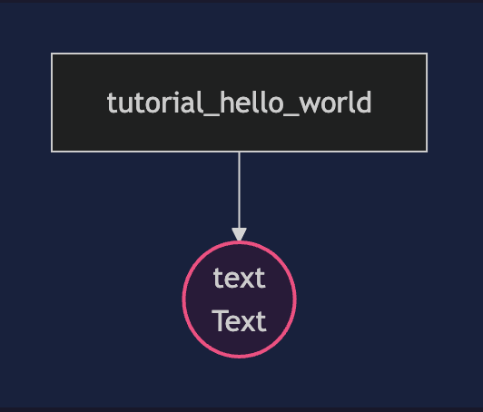
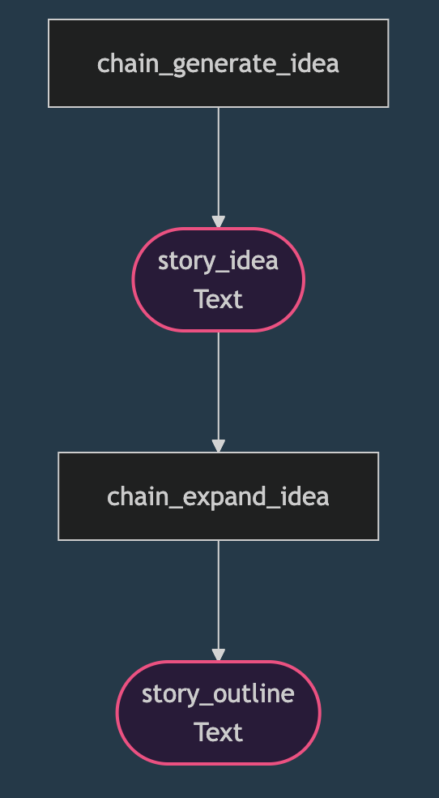
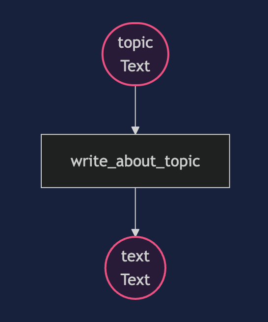
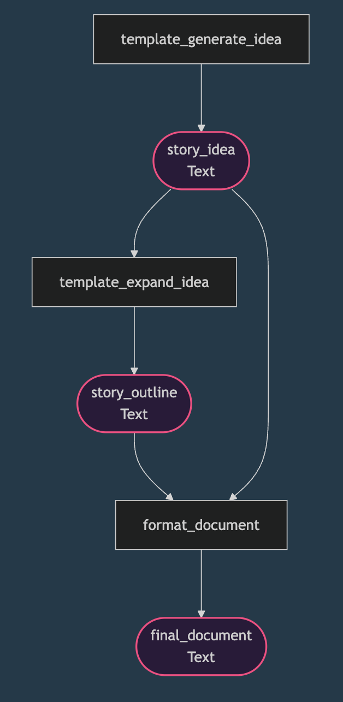

# LLM Basics

Learn the fundamentals of Pipelex pipelines.

---

## 1. Hello World - Your First Pipeline

The simplest pipeline: an LLM that generates text.

**File: `1_hello_world.plx`**

```plx
domain = "tutorial_hello_world"
description = "Your first Pipelex pipeline"

[pipe]

[pipe.tutorial_hello_world]
type = "PipeLLM"
description = "Generate a creative story idea"
output = "Text"
prompt = """
Generate a one-paragraph creative story idea about a robot learning to paint.
"""
```

**What you need to know:**
- `domain` - A name for your pipeline file
- `type = "PipeLLM"` - This pipe calls an LLM
- `output = "Text"` - The output is plain text
- `prompt` - The instructions for the LLM

**Run it:**
```bash
python tutorial/easy/llm_basics/1_hello_world.py
```



---

## 2. Chaining LLM Calls

What if you want to run **two LLM calls in sequence**? Use **PipeSequence**!

**File: `2_chaining_llm_calls.plx`**

```plx
domain = "chaining_llm_calls"
description = "Chain multiple LLM calls together"

[pipe]

# First pipe: Generate a story idea
[pipe.chain_generate_idea]
type = "PipeLLM"
description = "Generate a creative story idea"
output = "Text"
prompt = """
Generate a one-paragraph creative story idea about a robot learning to paint.
"""

# Second pipe: Expand the story idea (uses result from first pipe)
[pipe.chain_expand_idea]
type = "PipeLLM"
description = "Expand a story idea into a detailed outline"
inputs = { story_idea = "Text" }
output = "Text"
prompt = """
Take this story idea and expand it into a 3-act outline:

@story_idea

Provide a brief description for each act.
"""

# PipeSequence: Chain the two pipes together
[pipe.generate_and_expand]
type = "PipeSequence"
description = "Generate a story idea then expand it"
output = "Text"
steps = [
    { pipe = "chain_generate_idea", result = "story_idea" },
    { pipe = "chain_expand_idea", result = "story_outline" },
]
```

**What you need to know:**
- `PipeSequence` runs pipes one after another
- `inputs = { story_idea = "Text" }` - This pipe needs input from another pipe
- `@story_idea` - Insert the story_idea as a text block in the prompt
- `steps` - List the pipes to run in order, and name their results

**Run it:**
```bash
python tutorial/easy/llm_basics/2_chaining_llm_calls.py
```



---

## 3. Using Inputs

What if you want to **pass data into your pipeline** from Python? Use `inputs`!

**File: `3_using_inputs.plx`**

```plx
domain = "using_inputs"
description = "Learn how to pass inputs to your pipeline"

[pipe]

# A pipe that takes an input and uses it
[pipe.write_about_topic]
type = "PipeLLM"
description = "Write a short paragraph about a given topic"
inputs = { topic = "Text" }
output = "Text"
prompt = """
Write a short, engaging paragraph about the following topic:

$topic

Keep it under 100 words.
"""
```

**What you need to know:**
- `inputs = { topic = "Text" }` - Declare what inputs the pipe expects
- `$topic` - Insert the input inline in the prompt
- Pass inputs from Python using the `inputs` parameter

**Python code:**
```python
pipe_output = await execute_pipeline(
    pipe_code="write_about_topic",
    inputs={
        "topic": "The future of artificial intelligence",
    },
)
```

**Run it:**
```bash
python tutorial/easy/llm_basics/3_using_inputs.py
```



---

## 4. Using Templates

Want to **format the output** nicely? Use **PipeCompose**!

**File: `4_using_templates.plx`**

```plx
domain = "using_templates"
description = "Format output with templates"

[pipe]

# First pipe: Generate a story idea
[pipe.template_generate_idea]
type = "PipeLLM"
description = "Generate a creative story idea"
output = "Text"
prompt = """
Generate a one-paragraph creative story idea about a robot learning to paint.
"""

# Second pipe: Expand the story idea
[pipe.template_expand_idea]
type = "PipeLLM"
description = "Expand a story idea into a detailed outline"
inputs = { story_idea = "Text" }
output = "Text"
prompt = """
Take this story idea and expand it into a 3-act outline:

@story_idea

Provide a brief description for each act.
"""

# Third pipe: Format the output using a template
[pipe.format_document]
type = "PipeCompose"
description = "Format the story into a nice document"
inputs = { story_idea = "Text", story_outline = "Text" }
output = "Text"
template = """
# Story Document

## Original Idea

$story_idea

## Story Outline

$story_outline

---
*Generated with Pipelex*
"""

# Full pipeline: Generate, expand, and format
[pipe.create_story_document]
type = "PipeSequence"
description = "Generate, expand, and format a story"
output = "Text"
steps = [
    { pipe = "template_generate_idea", result = "story_idea" },
    { pipe = "template_expand_idea", result = "story_outline" },
    { pipe = "format_document", result = "final_document" },
]
```

**What you need to know:**
- `PipeCompose` formats output using templates
- `$variable` - Insert text inline (for short text)
- `@variable` - Insert text as a block (for long text)

**Run it:**
```bash
python tutorial/easy/llm_basics/4_using_templates.py
```



---

## Summary

| Pipe Type | What it does |
|-----------|--------------|
| `PipeLLM` | Call an LLM to generate or transform text |
| `PipeSequence` | Run multiple pipes one after another |
| `PipeCompose` | Format output using templates |

**Next:** Learn about [Structured Data](../structured_data/)!
